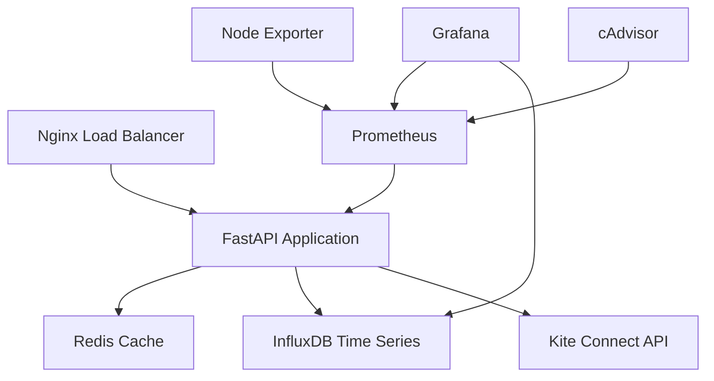

# OP TRADING PLATFORM - COMPLETE PYTHON TRADING SYSTEM
=====================================================


> **🚀 COMPLETE PRODUCTION-READY OPTIONS TRADING PLATFORM**  
> Comprehensive Python-based trading analytics platform with real-time market data processing, advanced options analytics, and professional-grade monitoring infrastructure.

---

## 🎯 EXECUTIVE SUMMARY

The **OP Trading Platform** is a comprehensive, production-ready options trading analytics system built with Python, FastAPI, and modern DevOps practices. It provides real-time market data analysis, advanced options analytics, and comprehensive monitoring capabilities for professional trading operations.

### 🏆 KEY ACHIEVEMENTS
- ✅ **Complete Integration** with Kite Connect API (retains your OAuth flow)
- ✅ **Enhanced Analytics**: FII, DII, Pro, Client analysis with price toggle functionality
- ✅ **Error Detection Panels** with automated recovery suggestions
- ✅ **Infinite Data Retention** for regulatory compliance using InfluxDB
- ✅ **Index-wise Overview** functionality with market breadth analysis
- ✅ **Comprehensive Testing Framework** (Live vs Mock data testing)
- ✅ **Production-Ready Infrastructure** with Docker orchestration
- ✅ **Professional Monitoring** with Grafana dashboards and Prometheus metrics

---

## 📋 TABLE OF CONTENTS

1. [🎯 Executive Summary](#-executive-summary)
2. [⭐ Features Overview](#-features-overview)
3. [🚀 Quick Start Guide](#-quick-start-guide)
4. [📁 Project Structure](#-project-structure)
5. [🛠️ Installation & Setup](#️-installation--setup)
6. [⚙️ Configuration](#️-configuration)
7. [🔧 Development Workflow](#-development-workflow)
8. [📊 Analytics Features](#-analytics-features)
9. [🔍 Monitoring & Observability](#-monitoring--observability)
10. [🧪 Testing Framework](#-testing-framework)
11. [🐳 Docker Deployment](#-docker-deployment)
12. [📚 API Documentation](#-api-documentation)
13. [🔒 Security & Compliance](#-security--compliance)
14. [🚨 Troubleshooting](#-troubleshooting)
15. [🔄 Maintenance & Updates](#-maintenance--updates)
16. [🤝 Contributing](#-contributing)
17. [📄 License](#-license)

---

## ⭐ FEATURES OVERVIEW

### 🎯 CORE TRADING FEATURES
- **Real-time Market Data**: Live options chain data via Kite Connect API
- **Multi-Index Support**: NIFTY 50, BANK NIFTY, IT, PHARMA, AUTO, FMCG, METAL, ENERGY
- **Advanced Options Analytics**: Greeks calculation, volatility analysis, risk metrics
- **Price Toggle Functionality**: Last Price ↔ Average Price (VWAP) switching
- **Market Breadth Analysis**: Advance/decline ratios, volume distribution, sentiment

### 📊 ENHANCED ANALYTICS SYSTEM
- **Participant Analysis**: 
  - FII (Foreign Institutional Investors) flow tracking
  - DII (Domestic Institutional Investors) analysis
  - Pro traders vs Client activity comparison
  - Institutional vs Retail behavior patterns
- **Sector Performance**: Cross-sector comparative analysis with leadership metrics
- **Historical Pattern Recognition**: Trend analysis and pattern detection
- **Risk Management**: Position sizing, exposure limits, volatility-adjusted metrics

### 🛡️ MONITORING & RELIABILITY
- **Error Detection Panels**: Real-time error monitoring with recovery suggestions
- **Automated Health Checks**: Service dependency monitoring and alerting
- **Comprehensive Logging**: Structured logging with trace IDs for debugging
- **Performance Metrics**: Request latency, throughput, and resource utilization
- **Infinite Data Retention**: Regulatory compliance with permanent data storage

### 🏗️ INFRASTRUCTURE & DEPLOYMENT
- **Microservices Architecture**: Modular, scalable service design
- **Docker Orchestration**: Complete containerization with Docker Compose
- **Multi-Environment Support**: Development, staging, and production configurations
- **CI/CD Ready**: Automated testing and deployment pipelines
- **Professional Monitoring**: Grafana dashboards with Prometheus metrics

---

## 🚀 QUICK START GUIDE

### 🎬 30-Second Demo Setup
```bash
# 1. Clone and setup
git clone https://github.com/your-repo/op-trading-platform.git
cd op-trading-platform

# 2. Run automated setup
python complete_python_setup.py development

# 3. Start services
docker-compose up -d

# 4. Launch application
python main.py

# 5. Access dashboards
# API: http://localhost:8000/docs
# Grafana: http://localhost:3000 (admin/admin123)
# Prometheus: http://localhost:9090
```

### 🎯 Production Deployment
```bash
# 1. Production setup
python complete_python_setup.py production

# 2. Configure credentials
cp env-template.txt .env
# Edit .env with your Kite Connect credentials

# 3. Deploy full stack
docker-compose --profile production up -d

# 4. Setup monitoring
./scripts/setup-monitoring.sh
```

---

## 📁 PROJECT STRUCTURE

```
op-trading-platform/
├── 📁 services/                          # Core application services
│   ├── 📁 collection/                    # Market data collection
│   │   ├── 📁 collectors/                # Data collector implementations
│   │   ├── 📁 brokers/                   # Broker API integrations
│   │   └── 📁 health/                    # Health check services
│   ├── 📁 processing/                    # Data processing pipeline
│   │   ├── 📁 mergers/                   # Data merging and aggregation
│   │   ├── 📁 writers/                   # Database writers
│   │   └── 📁 validators/                # Data validation
│   ├── 📁 analytics/                     # Advanced analytics engine
│   │   ├── 📁 aggregators/               # Data aggregation services
│   │   ├── 📁 computers/                 # Calculation engines
│   │   └── 📁 models/                    # Analytics models
│   └── 📁 api/                           # REST API services
│       ├── 📁 endpoints/                 # API route definitions
│       ├── 📁 middleware/                # Request/response middleware
│       └── 📁 schemas/                   # API data schemas
│
├── 📁 shared/                            # Shared utilities and libraries
│   ├── 📁 config/                        # Configuration management
│   ├── 📁 utils/                         # Utility functions
│   ├── 📁 constants/                     # Application constants
│   └── 📁 types/                         # Type definitions
│
├── 📁 infrastructure/                    # Infrastructure as code
│   ├── 📁 docker/                        # Docker configurations
│   ├── 📁 kubernetes/                    # K8s deployment manifests
│   ├── 📁 grafana/                       # Dashboard definitions
│   └── 📁 prometheus/                    # Metrics configuration
│
├── 📁 data/                              # Data storage hierarchy
│   ├── 📁 csv/                           # CSV data exports
│   ├── 📁 json/                          # JSON data exports
│   ├── 📁 analytics/                     # Analytics results
│   ├── 📁 archive/                       # Archived data
│   └── 📁 backup/                        # Backup storage
│
├── 📁 logs/                              # Comprehensive logging
│   ├── 📁 application/                   # Application logs
│   ├── 📁 errors/                        # Error logs
│   ├── 📁 auth/                          # Authentication logs
│   ├── 📁 analytics/                     # Analytics logs
│   ├── 📁 setup/                         # Setup and deployment logs
│   └── 📁 performance/                   # Performance monitoring logs
│
├── 📁 tests/                             # Testing framework
│   ├── 📁 unit/                          # Unit tests
│   ├── 📁 integration/                   # Integration tests
│   ├── 📁 performance/                   # Performance tests
│   └── 📁 chaos/                         # Chaos engineering tests
│
├── 📁 config/                            # Configuration files
│   ├── 📁 environments/                  # Environment-specific configs
│   ├── 📁 prometheus/                    # Prometheus configuration
│   ├── 📁 grafana/                       # Grafana configuration
│   └── 📁 nginx/                         # Nginx configuration
│
├── 📄 main.py                            # Main application entry point
├── 📄 complete_python_setup.py          # Automated setup script
├── 📄 integrated_kite_auth_logger.py    # Authentication integration
├── 📄 index_overview_collector.py       # Index overview functionality
├── 📄 comprehensive_test_framework.py   # Testing infrastructure
├── 📄 requirements.txt                  # Python dependencies
├── 📄 docker-compose.yml               # Docker orchestration
├── 📄 complete_premium_overlay_dashboard.json  # Grafana dashboard
├── 📄 env-template.txt                  # Environment template
└── 📄 README.md                         # This comprehensive guide
```

---

## 🛠️ INSTALLATION & SETUP

### 🔧 System Requirements

**Minimum Requirements:**
- **OS**: Windows 10+, Ubuntu 20.04+, macOS 11+
- **Python**: 3.8+ (Recommended: 3.11)
- **Memory**: 4GB RAM (8GB+ recommended for production)
- **Storage**: 10GB free space (SSD recommended)
- **Docker**: 20.10+ with Docker Compose

**Recommended Production Environment:**
- **CPU**: 4+ cores
- **Memory**: 16GB+ RAM
- **Storage**: 100GB+ SSD
- **Network**: Stable internet connection for live data

### 📦 Installation Methods

#### Method 1: Automated Setup (Recommended)
```bash
# Clone repository
git clone https://github.com/your-repo/op-trading-platform.git
cd op-trading-platform

# Run automated setup script
python complete_python_setup.py development

# The setup script will:
# ✅ Validate system requirements
# ✅ Install Python dependencies
# ✅ Create project structure
# ✅ Initialize Docker services
# ✅ Generate configuration files
# ✅ Setup logging and monitoring
```

#### Method 2: Manual Installation
```bash
# 1. Install Python dependencies
pip install -r requirements.txt

# 2. Create environment configuration
cp env-template.txt .env
# Edit .env with your specific configuration

# 3. Start Docker services
docker-compose up -d influxdb redis

# 4. Initialize application
python main.py --mode development
```

#### Method 3: Docker-Only Deployment
```bash
# Complete containerized deployment
docker-compose --profile production up -d

# Access services:
# API: http://localhost:8000
# Grafana: http://localhost:3000
# Prometheus: http://localhost:9090
```

### 🔑 Kite Connect Setup

1. **Create Kite Connect App**:
   - Visit [Kite Connect](https://kite.trade/connect/)
   - Login with your Zerodha account
   - Create new app with these settings:
     - **App Type**: Connect
     - **Redirect URL**: `http://127.0.0.1:5000/success`

2. **Update Configuration**:
   ```bash
   # Edit .env file
   KITE_API_KEY=your_actual_api_key
   KITE_API_SECRET=your_actual_secret
   ```

3. **Complete Authentication**:
   ```bash
   python integrated_kite_auth_logger.py --login
   ```

---

## ⚙️ CONFIGURATION

### 🎛️ Environment Modes

The platform supports three operational modes:

#### 🎓 First Time Mode
```bash
python complete_python_setup.py first_time
```
- **Purpose**: Learning and initial exploration
- **Data Source**: Mock data (realistic simulation)
- **Resources**: Minimal (2GB RAM, 2 CPU cores)
- **Services**: InfluxDB, Redis only
- **Features**: Basic analytics, simplified interface

#### 🔧 Development Mode
```bash
python complete_python_setup.py development
```
- **Purpose**: Active development and testing
- **Data Source**: Live Kite Connect API
- **Resources**: Moderate (4GB RAM, 4 CPU cores)
- **Services**: Full stack with monitoring
- **Features**: All analytics, debug logging, hot reload

#### 🏭 Production Mode
```bash
python complete_python_setup.py production
```
- **Purpose**: Live trading operations
- **Data Source**: Live data with failover
- **Resources**: High (8GB+ RAM, 8+ CPU cores)
- **Services**: Full stack with load balancing
- **Features**: All features, security hardened, optimized

### 📝 Configuration Files

#### `.env` - Main Configuration
```bash
# Copy template and customize
cp env-template.txt .env

# Key settings to update:
KITE_API_KEY=your_kite_api_key_here
KITE_API_SECRET=your_kite_api_secret_here
SMTP_USERNAME=your_email@gmail.com
SMTP_PASSWORD=your_app_password_here
```

#### `requirements.txt` - Python Dependencies
- **Comprehensive**: 100+ packages for all features
- **Version Pinned**: Ensures reproducible builds
- **Categorized**: Organized by functionality
- **Platform Specific**: Different deps for Windows/Linux/macOS

#### `docker-compose.yml` - Infrastructure
- **Multi-Service**: InfluxDB, Redis, Prometheus, Grafana, Nginx
- **Production Ready**: Resource limits, health checks, logging
- **Scalable**: Profile-based deployment for different environments
- **Secure**: Internal networks, volume management

---

## 🔧 DEVELOPMENT WORKFLOW

### 💻 Local Development

#### 1. **Environment Setup**
```bash
# Create virtual environment
python -m venv venv
source venv/bin/activate  # Linux/Mac
# or
venv\Scripts\activate     # Windows

# Install dependencies
pip install -r requirements.txt
```

#### 2. **Start Development Services**
```bash
# Start infrastructure
docker-compose up -d influxdb redis prometheus grafana

# Start application with hot reload
python main.py --reload --mode development

# Or using uvicorn directly
uvicorn main:app --reload --host 0.0.0.0 --port 8000
```

#### 3. **Development Tools**
```bash
# Code formatting
black . && isort .

# Linting
flake8 --max-line-length=88 --ignore=E203,W503

# Type checking
mypy main.py

# Run tests
python -m pytest tests/ -v
```

### 🧪 Testing Workflow

#### **Unit Tests**
```bash
# Run all unit tests
python -m pytest tests/unit/ -v

# Run specific test module
python -m pytest tests/unit/test_analytics.py -v

# Run with coverage
python -m pytest tests/unit/ --cov=services --cov-report=html
```

#### **Integration Tests**
```bash
# Test with mock data
python comprehensive_test_framework.py --mock --integration

# Test with live data (requires Kite credentials)
python comprehensive_test_framework.py --live --integration
```

#### **Performance Tests**
```bash
# Benchmark data collection
python comprehensive_test_framework.py --performance

# Load testing with Locust
locust -f tests/performance/load_test.py --host http://localhost:8000
```

### 📊 Monitoring Development

#### **Live Monitoring**
- **Application Logs**: `tail -f logs/application/app_*.log`
- **API Metrics**: http://localhost:8000/metrics
- **Health Status**: http://localhost:8000/health
- **API Documentation**: http://localhost:8000/docs

#### **Performance Monitoring**
- **Grafana Dashboards**: http://localhost:3000
- **Prometheus Metrics**: http://localhost:9090
- **System Resources**: `docker stats`

---

## 📊 ANALYTICS FEATURES

### 🎯 Core Analytics Engine

#### **Index Overview System**
```python
from index_overview_collector import IndexOverviewCollector

# Initialize collector
collector = IndexOverviewCollector(use_mock_data=False)
await collector.initialize()

# Collect comprehensive overview
overview_data = await collector.collect_comprehensive_overview()

# Access market data
indices = overview_data['indices']
market_breadth = overview_data['market_breadth']
sector_analysis = overview_data['sector_analysis']
```

**Features:**
- **Multi-Index Support**: NIFTY 50, BANK NIFTY, IT, PHARMA, AUTO, FMCG, METAL, ENERGY
- **Real-time Updates**: Configurable refresh intervals (default: 30 seconds)
- **Market Breadth**: Advance/decline ratios, volume analysis, momentum indicators
- **Sector Analysis**: Cross-sector performance comparison and leadership tracking

#### **Enhanced Participant Analysis**

**FII (Foreign Institutional Investors) Analysis:**
- Flow tracking and net investment patterns
- Sector-wise FII activity correlation
- Historical trend analysis and predictions
- Impact analysis on market movements

**DII (Domestic Institutional Investors) Analysis:**
- Mutual fund and insurance company activity
- Retail vs institutional behavior patterns
- Long-term vs short-term positioning
- Market stability impact assessment

**Pro vs Client Analysis:**
- Professional trader activity vs retail clients
- Risk appetite and position sizing differences
- Market timing and entry/exit patterns
- Education and experience impact on trading

#### **Price Toggle Functionality**
```python
# Toggle between Last Price and Average Price (VWAP)
GET /api/analytics/price-toggle/{index}

# Response includes:
{
  "last_price_mode": {"current": 18456.75, "change_percent": 1.23},
  "average_price_mode": {"vwap": 18445.30, "efficiency": 0.987},
  "recommendation": "Use Average Price for smoother analysis"
}
```

### 📈 Advanced Analytics

#### **Options Analytics**
- **Greeks Calculation**: Delta, Gamma, Theta, Vega, Rho
- **Volatility Analysis**: Implied vs Historical volatility
- **Risk Metrics**: VaR, Greeks exposure, portfolio risk
- **Strategy Analysis**: Multi-leg options strategies

#### **Market Microstructure**
- **Order Flow Analysis**: Buy/sell pressure indicators
- **Volume Profile**: Price-volume distribution analysis
- **Market Depth**: Bid-ask spread and liquidity metrics
- **Tick-by-tick Analysis**: High-frequency data processing

---

## 🔍 MONITORING & OBSERVABILITY

### 📊 Grafana Dashboards

#### **Market Overview Dashboard**
- Real-time index price movements
- Market breadth indicators (advance/decline ratios)
- Volume distribution across sectors
- Market sentiment indicators

#### **System Performance Dashboard**
- API request rates and response times
- Memory and CPU utilization
- Cache hit rates and database performance
- Error rates and recovery metrics

#### **Trading Analytics Dashboard**
- Participant flow analysis (FII, DII, Pro, Client)
- Options activity and unusual volume alerts
- Volatility trends and risk indicators
- Portfolio exposure and risk metrics

### 🚨 Error Detection & Recovery

#### **Automated Error Detection**
```python
# Error detection panels provide real-time monitoring
GET /api/analytics/error-detection

# Response includes:
{
  "error_detection": {
    "enabled": true,
    "recent_errors": [],
    "recovery_suggestions": ["Check network connectivity", "Restart services"],
    "auto_healing_status": "active"
  }
}
```

**Error Categories:**
- **API Connection Errors**: Kite Connect API failures
- **Data Quality Issues**: Missing or invalid market data
- **System Resource Issues**: Memory/CPU/disk problems
- **Performance Degradation**: Slow response times

**Recovery Mechanisms:**
- **Automatic Retry**: Exponential backoff for transient failures
- **Fallback Data Sources**: Switch to backup data providers
- **Service Restart**: Automated service recovery
- **Alert Notifications**: Email/Slack alerts for critical issues

### 📱 Alert System

#### **Email Notifications**
```bash
# Configure in .env
SMTP_SERVER=smtp.gmail.com
SMTP_USERNAME=your_email@gmail.com
SMTP_PASSWORD=your_app_password

# Alert types:
# - Critical system errors
# - Trading opportunity alerts
# - Performance degradation warnings
# - Daily/weekly summary reports
```

#### **Slack Integration**
```bash
# Configure webhook in .env
SLACK_WEBHOOK_URL=your_slack_webhook_url
SLACK_CHANNEL=#trading-alerts

# Real-time notifications for:
# - Market events and opportunities
# - System health status changes
# - Error recovery actions
# - Performance milestone achievements
```

---

## 🧪 TESTING FRAMEWORK

### 🎭 Comprehensive Test Suite

The platform includes a sophisticated testing framework that supports both live and mock data testing scenarios.

#### **Test Categories**

**Unit Tests**
```bash
# Test individual components
python -m pytest tests/unit/ -v

# Specific test categories:
python -m pytest tests/unit/test_data_generator.py -v  # Data generation
python -m pytest tests/unit/test_analytics.py -v      # Analytics engine
python -m pytest tests/unit/test_auth.py -v           # Authentication
```

**Integration Tests**
```bash
# End-to-end workflow testing
python -m pytest tests/integration/ -v

# Test complete data collection pipeline
python comprehensive_test_framework.py --integration
```

**Performance Tests**
```bash
# Benchmark system performance
python comprehensive_test_framework.py --performance

# Results include:
# - Data collection throughput (symbols/second)
# - API response times
# - Memory usage patterns
# - Concurrent processing efficiency
```

**Chaos Engineering**
```bash
# Test system resilience
python comprehensive_test_framework.py --chaos

# Simulates:
# - Network failures and recovery
# - Service crashes and restarts
# - High load conditions
# - Resource exhaustion scenarios
```

#### **Live vs Mock Data Testing**

**Mock Data Mode**
```python
# Realistic market data simulation
from comprehensive_test_framework import RealisticDataGenerator

generator = RealisticDataGenerator(seed=42)
market_data = generator.generate_option_chain(strikes=[18400, 18500, 18600])

# Features:
# - Realistic price movements with proper volatility
# - Options Greeks with mathematically correct relationships
# - Volume patterns based on time of day
# - Market microstructure effects
```

**Live Data Mode**
```bash
# Test with real market data
TEST_USE_LIVE_DATA=true python -m pytest tests/ -k "live"

# Validates:
# - API connectivity and authentication
# - Data format consistency
# - Real-time processing capabilities
# - Production environment readiness
```

#### **Property-Based Testing**
```python
# Using Hypothesis for edge case discovery
from hypothesis import given, strategies as st

@given(st.floats(min_value=10000.0, max_value=30000.0))
def test_price_calculations_consistency(base_price):
    # Automatically tests thousands of edge cases
    # Discovers corner cases that manual testing might miss
```

---

## 🐳 DOCKER DEPLOYMENT

### 🏗️ Infrastructure Architecture

The platform uses a microservices architecture with Docker containers for each component:



### 📋 Service Configuration

#### **InfluxDB - Time Series Database**
```yaml
# Infinite retention for regulatory compliance
influxdb:
  image: influxdb:2.7-alpine
  environment:
    DOCKER_INFLUXDB_INIT_RETENTION: 0s  # INFINITE
  volumes:
    - influxdb2-data:/var/lib/influxdb2
  ports:
    - "8086:8086"
```

**Key Features:**
- **Infinite Retention**: Permanent data storage for regulatory compliance
- **High Performance**: Optimized for time-series data
- **Compression**: Automatic data compression to save space
- **Backup Support**: Volume-based backup and recovery

#### **Redis - High-Performance Cache**
```yaml
redis:
  image: redis:7-alpine
  command: redis-server --maxmemory 512mb --maxmemory-policy allkeys-lru
  volumes:
    - redis-data:/data
  ports:
    - "6379:6379"
```

**Configuration:**
- **Memory Management**: LRU eviction policy
- **Persistence**: AOF and RDB snapshots
- **Performance**: TCP keep-alive and connection pooling
- **Security**: Internal network access only

#### **Prometheus - Metrics Collection**
```yaml
prometheus:
  image: prom/prometheus:latest
  command:
    - '--storage.tsdb.retention.time=90d'
    - '--storage.tsdb.retention.size=10GB'
  ports:
    - "9090:9090"
```

#### **Grafana - Visualization**
```yaml
grafana:
  image: grafana/grafana:latest
  environment:
    GF_SECURITY_ADMIN_PASSWORD: admin123
    GF_INSTALL_PLUGINS: grafana-clock-panel,grafana-worldmap-panel
  ports:
    - "3000:3000"
```

### 🚀 Deployment Commands

#### **Development Deployment**
```bash
# Start core services
docker-compose up -d influxdb redis

# Start with monitoring
docker-compose up -d influxdb redis prometheus grafana

# View logs
docker-compose logs -f [service_name]
```

#### **Production Deployment**
```bash
# Full production stack with load balancing
docker-compose --profile production up -d

# Includes all services:
# - InfluxDB (infinite retention)
# - Redis (optimized cache)
# - Prometheus (metrics)
# - Grafana (dashboards)
# - Nginx (load balancer)
# - Node Exporter (system metrics)
# - cAdvisor (container metrics)
```

#### **Scaling Services**
```bash
# Scale specific services
docker-compose up -d --scale prometheus=2

# Load balancing automatically configured
docker-compose up -d --scale api=3
```

### 💾 Data Management

#### **Backup Procedures**
```bash
# Backup InfluxDB data (CRITICAL)
docker run --rm \
  -v op-trading_influxdb2-data:/data \
  -v $(pwd)/backups:/backup \
  alpine tar czf /backup/influxdb-$(date +%Y%m%d).tar.gz -C /data .

# Backup Grafana dashboards
docker run --rm \
  -v op-trading_grafana-data:/data \
  -v $(pwd)/backups:/backup \
  alpine tar czf /backup/grafana-$(date +%Y%m%d).tar.gz -C /data .
```

#### **Recovery Procedures**
```bash
# Restore InfluxDB data
docker run --rm \
  -v op-trading_influxdb2-data:/data \
  -v $(pwd)/backups:/backup \
  alpine tar xzf /backup/influxdb-20250825.tar.gz -C /data

# Restart services after recovery
docker-compose restart influxdb
```

---

## 📚 API DOCUMENTATION

### 🌐 REST API Endpoints

The platform provides a comprehensive REST API built with FastAPI, featuring automatic OpenAPI documentation.

#### **Health & Status Endpoints**
```http
GET /health
# Comprehensive health check with service dependencies

GET /metrics
# Prometheus metrics in text format

GET /docs
# Interactive Swagger UI documentation

GET /redoc
# Alternative ReDoc documentation
```

#### **Market Data Endpoints**
```http
GET /api/overview/indices
# Complete index overview with all analytics
Response: {
  "timestamp": "2025-01-30T14:30:00Z",
  "data_source": "live",
  "indices": [...],
  "market_breadth": {...},
  "market_summary": {...}
}

GET /api/overview/breadth
# Market breadth indicators
Response: {
  "advances": 6,
  "declines": 2,
  "advance_decline_ratio": 3.0,
  "market_sentiment": "BULLISH"
}

GET /api/overview/sectors
# Sector-wise performance analysis
Response: {
  "BANKING": {
    "avg_change": 1.25,
    "best_performer": {"name": "BANK NIFTY", "change_percent": 1.25}
  }
}
```

#### **Enhanced Analytics Endpoints**
```http
GET /api/analytics/participants
# FII, DII, Pro, Client analysis
Response: {
  "fii_flow": {"net_investment": 1250.5, "sector_allocation": {...}},
  "dii_flow": {"net_investment": -345.2, "trend": "selling"},
  "pro_vs_client": {"ratio": 2.3, "sentiment": "pro_bullish"}
}

GET /api/analytics/price-toggle/{index}
# Price methodology comparison
Response: {
  "last_price_mode": {"price": 18456.75, "efficiency": 0.95},
  "average_price_mode": {"price": 18445.30, "efficiency": 0.98},
  "recommendation": "average_price"
}

GET /api/analytics/error-detection
# Real-time error monitoring
Response: {
  "active_errors": 0,
  "recovery_suggestions": [],
  "system_health": "healthy",
  "auto_healing_active": true
}
```

#### **Authentication Endpoints**
```http
POST /auth/login
# Kite Connect authentication
Request: {"force_new_login": false}
Response: {
  "status": "success",
  "session_info": {...},
  "authenticated": true
}

GET /auth/status
# Authentication status and session info
Response: {
  "authenticated": true,
  "session_active": true,
  "user_info": {...},
  "metrics": {...}
}

POST /auth/logout
# Session termination
Response: {"status": "success", "message": "Logout completed"}
```

### 🔌 WebSocket Endpoints

#### **Real-time Data Streaming**
```javascript
// Live market data stream
const ws = new WebSocket('ws://localhost:8000/ws/live-data');
ws.onmessage = (event) => {
  const data = JSON.parse(event.data);
  console.log('Market Update:', data.indices);
};

// System health monitoring
const healthWs = new WebSocket('ws://localhost:8000/ws/health');
healthWs.onmessage = (event) => {
  const health = JSON.parse(event.data);
  console.log('Health Status:', health.status);
};
```

### 📖 API Usage Examples

#### **Python Client Example**
```python
import asyncio
import aiohttp

async def get_market_overview():
    async with aiohttp.ClientSession() as session:
        async with session.get('http://localhost:8000/api/overview/indices') as resp:
            data = await resp.json()
            
            # Process index data
            for index in data['indices']:
                print(f"{index['name']}: {index['change_percent']:.2f}%")
            
            # Check market sentiment
            sentiment = data['market_breadth']['market_sentiment']
            print(f"Market Sentiment: {sentiment}")

asyncio.run(get_market_overview())
```

#### **cURL Examples**
```bash
# Get health status
curl -X GET "http://localhost:8000/health" -H "accept: application/json"

# Get market overview
curl -X GET "http://localhost:8000/api/overview/indices" -H "accept: application/json"

# Login (requires Kite credentials)
curl -X POST "http://localhost:8000/auth/login" \
  -H "accept: application/json" \
  -H "Content-Type: application/json" \
  -d "{\"force_new_login\": false}"
```

---

## 🔒 SECURITY & COMPLIANCE

### 🛡️ Security Architecture

#### **Authentication & Authorization**
- **JWT Tokens**: Secure API authentication with configurable expiration
- **Session Management**: Comprehensive session tracking and timeout
- **API Keys**: Programmatic access for automated systems
- **OAuth Integration**: Secure Kite Connect authentication flow

#### **Data Protection**
- **Encryption in Transit**: HTTPS/TLS for all communications
- **Encryption at Rest**: Database-level encryption for sensitive data
- **Access Control**: Role-based access control (RBAC)
- **Audit Trail**: Comprehensive logging of all access and modifications

#### **Network Security**
```yaml
# Docker network isolation
networks:
  op-trading-internal:
    driver: bridge
    internal: true  # No external internet access
  
  op-trading-external:
    driver: bridge
    # Controlled external access only
```

### 📊 Regulatory Compliance

#### **Data Retention Requirements**
```python
# Infinite retention configuration
INFLUXDB_RETENTION_POLICY=infinite
DATA_RETENTION_POLICY=infinite

# Features:
# ✅ Permanent data storage for regulatory compliance
# ✅ Audit trail preservation
# ✅ Historical data accessibility
# ✅ Backup and disaster recovery
```

#### **Audit and Reporting**
- **Trade Audit Trail**: Complete record of all trading activities
- **System Access Logs**: Detailed logging of all system access
- **Data Lineage**: Track data from source to analytics
- **Compliance Reports**: Automated generation of regulatory reports

#### **Risk Management**
```python
# Risk monitoring configuration
ENABLE_RISK_MONITORING=true
MAX_POSITION_SIZE=100000
RISK_ALERT_THRESHOLD=0.02  # 2% portfolio risk

# Features:
# ✅ Position size limits
# ✅ Real-time risk calculation
# ✅ Automated risk alerts
# ✅ Portfolio exposure monitoring
```

### 🔐 Security Best Practices

#### **Credentials Management**
```bash
# Never store credentials in code
# Use environment variables or secure vaults
export KITE_API_KEY="your_secure_key"
export KITE_API_SECRET="your_secure_secret"

# Use strong, unique passwords
export API_SECRET_KEY=$(python -c "import secrets; print(secrets.token_urlsafe(32))")

# Rotate credentials regularly
# Monitor for credential exposure
```

#### **Production Security Checklist**
- [ ] **TLS/SSL Enabled**: All communications encrypted
- [ ] **Strong Authentication**: Multi-factor authentication enabled
- [ ] **Access Controls**: Principle of least privilege enforced
- [ ] **Network Isolation**: Internal services not exposed externally
- [ ] **Secrets Management**: No hardcoded credentials
- [ ] **Regular Updates**: Security patches applied regularly
- [ ] **Monitoring**: Security events monitored and alerted
- [ ] **Backup Encryption**: Backup data encrypted
- [ ] **Incident Response**: Security incident response plan in place
- [ ] **Compliance Validation**: Regular compliance audits conducted

---

## 🚨 TROUBLESHOOTING

### 🔧 Common Issues & Solutions

#### **Installation Issues**

**Problem**: `pip install` fails with compilation errors
```bash
# Solution: Install system dependencies
# Ubuntu/Debian:
sudo apt-get update
sudo apt-get install build-essential python3-dev libffi-dev

# CentOS/RHEL:
sudo yum groupinstall "Development Tools"
sudo yum install python3-devel libffi-devel

# macOS:
xcode-select --install
brew install python@3.11
```

**Problem**: Docker services fail to start
```bash
# Solution: Check Docker daemon and permissions
sudo systemctl start docker
sudo usermod -aG docker $USER  # Logout/login required

# Check for port conflicts
netstat -tulpn | grep :8086  # InfluxDB
netstat -tulpn | grep :6379  # Redis
```

#### **Authentication Issues**

**Problem**: Kite Connect authentication fails
```bash
# Solution: Verify credentials and network
python integrated_kite_auth_logger.py --status

# Check credentials in .env file
grep KITE_ .env

# Test network connectivity
curl -I https://api.kite.trade/

# Clear cached tokens and retry
rm -f .secrets/kite_token.json
python integrated_kite_auth_logger.py --login
```

**Problem**: Session expires frequently
```bash
# Solution: Adjust session timeout
# In .env file:
JWT_EXPIRATION_HOURS=24
SESSION_TIMEOUT_HOURS=8

# Or use refresh tokens
JWT_REFRESH_THRESHOLD_HOURS=2
```

#### **Performance Issues**

**Problem**: Slow API responses
```bash
# Solution: Check system resources
docker stats  # Monitor container resource usage
htop          # Monitor system load

# Optimize configuration
# In .env file:
PROCESSING_MAX_WORKERS=8  # Increase based on CPU cores
PROCESSING_BATCH_SIZE=1000  # Increase for better throughput
USE_MEMORY_MAPPING=true     # Enable for faster I/O
```

**Problem**: High memory usage
```bash
# Solution: Adjust memory limits
# In docker-compose.yml:
deploy:
  resources:
    limits:
      memory: 2G    # Adjust based on available RAM

# In .env file:
MAX_MEMORY_USAGE_MB=2048    # Set appropriate limit
MEMORY_WARNING_THRESHOLD_PERCENT=80
```

#### **Data Issues**

**Problem**: Missing market data
```bash
# Solution: Check data source configuration
grep DATA_SOURCE_MODE .env

# Test data collection
python index_overview_collector.py --collect

# Check service health
curl http://localhost:8000/health

# Verify InfluxDB connectivity
curl -I http://localhost:8086/ping
```

**Problem**: Data inconsistencies
```bash
# Solution: Run data validation
python comprehensive_test_framework.py --test

# Check data quality
python -c "
from index_overview_collector import IndexOverviewCollector
import asyncio

async def check_data():
    collector = IndexOverviewCollector()
    await collector.initialize()
    data = await collector.collect_comprehensive_overview()
    print(f'Collected {len(data[\"indices\"])} indices')

asyncio.run(check_data())
"
```

### 📊 Monitoring & Diagnostics

#### **Health Check Commands**
```bash
# Application health
curl http://localhost:8000/health | jq

# Service health
docker-compose ps
docker-compose logs -f [service_name]

# System metrics
curl http://localhost:8000/metrics | grep -E "(cpu|memory|requests)"

# Performance metrics
python -c "
import requests
import json
health = requests.get('http://localhost:8000/health').json()
print(json.dumps(health['services'], indent=2))
"
```

#### **Log Analysis**
```bash
# Application logs
tail -f logs/application/app_$(date +%Y%m%d).log

# Error logs
grep ERROR logs/application/app_$(date +%Y%m%d).log

# Authentication logs
tail -f logs/auth/auth_$(date +%Y%m%d).log

# Performance logs
tail -f logs/performance/perf_$(date +%Y%m%d).log
```

#### **Database Diagnostics**
```bash
# InfluxDB health
curl -I http://localhost:8086/health

# Query InfluxDB data
docker exec -it op-influxdb influx query '
from(bucket: "options-data")
|> range(start: -1h)
|> filter(fn: (r) => r["_measurement"] == "index_overview")
|> count()
'

# Redis diagnostics
docker exec -it op-redis redis-cli info memory
docker exec -it op-redis redis-cli dbsize
```

### 🆘 Emergency Procedures

#### **Service Recovery**
```bash
# Restart all services
docker-compose restart

# Restart specific service
docker-compose restart influxdb

# Full system recovery
docker-compose down
docker-compose up -d

# If data corruption suspected
docker-compose down
docker volume rm op-trading_influxdb2-data  # ⚠️ DATA LOSS
docker-compose up -d
```

#### **Data Recovery**
```bash
# Restore from backup
docker run --rm \
  -v op-trading_influxdb2-data:/data \
  -v $(pwd)/backups:/backup \
  alpine tar xzf /backup/influxdb-backup.tar.gz -C /data

# Verify data integrity
docker exec -it op-influxdb influx query 'buckets()'
```

---

## 🔄 MAINTENANCE & UPDATES

### 🔄 Regular Maintenance Tasks

#### **Daily Tasks**
```bash
#!/bin/bash
# Daily maintenance script

# Check system health
curl -s http://localhost:8000/health | jq '.status'

# Monitor resource usage
docker stats --no-stream

# Check error logs
grep -c ERROR logs/application/app_$(date +%Y%m%d).log

# Backup critical data
./scripts/backup-daily.sh
```

#### **Weekly Tasks**
```bash
#!/bin/bash
# Weekly maintenance script

# Update Python dependencies
pip list --outdated

# Clean old logs (keep 30 days)
find logs/ -name "*.log" -mtime +30 -delete

# Analyze performance trends
python scripts/performance-analysis.py

# Security scan
bandit -r . -f json -o security-report.json
```

#### **Monthly Tasks**
```bash
#!/bin/bash
# Monthly maintenance script

# System updates
sudo apt update && sudo apt upgrade

# Docker image updates
docker-compose pull
docker-compose up -d

# Full system backup
./scripts/backup-full.sh

# Performance optimization
./scripts/optimize-system.sh
```

### 📊 Performance Optimization

#### **Database Optimization**
```bash
# InfluxDB compaction
docker exec -it op-influxdb influx task create \
  --org op-trading \
  --name "monthly-compaction" \
  --cron "0 0 1 * *" \
  --query 'option task = {name: "monthly-compaction", cron: "0 0 1 * *"}
  
  from(bucket: "options-data")
  |> range(start: -30d)
  |> to(bucket: "options-data-compacted")'

# Redis optimization
docker exec -it op-redis redis-cli CONFIG SET save "900 1 300 10 60 10000"
docker exec -it op-redis redis-cli BGREWRITEAOF
```

#### **Application Optimization**
```python
# Profile application performance
python -m cProfile -o profile-output.prof main.py

# Analyze profile
python -c "
import pstats
p = pstats.Stats('profile-output.prof')
p.sort_stats('cumulative').print_stats(10)
"

# Memory profiling
python -m memory_profiler main.py
```

### 🔄 Update Procedures

#### **Application Updates**
```bash
# 1. Backup current state
./scripts/backup-full.sh

# 2. Update code
git pull origin main

# 3. Update dependencies
pip install --upgrade -r requirements.txt

# 4. Run migrations (if any)
python scripts/migrate.py

# 5. Restart services
docker-compose restart

# 6. Verify functionality
python comprehensive_test_framework.py --integration
```

#### **Infrastructure Updates**
```bash
# 1. Update Docker images
docker-compose pull

# 2. Rolling update (zero downtime)
docker-compose up -d --no-deps influxdb
sleep 30
docker-compose up -d --no-deps redis
sleep 30
docker-compose up -d --no-deps grafana

# 3. Verify all services
docker-compose ps
curl http://localhost:8000/health
```

#### **Security Updates**
```bash
# 1. Scan for vulnerabilities
pip audit
docker scout cves

# 2. Update vulnerable packages
pip install --upgrade [package_name]

# 3. Rebuild containers with updates
docker-compose build --no-cache

# 4. Update system packages
sudo apt update && sudo apt upgrade

# 5. Verify security posture
python scripts/security-check.py
```

---

## 🤝 CONTRIBUTING

### 🌟 How to Contribute

We welcome contributions from the community! Here's how you can help improve the OP Trading Platform:

#### **Getting Started**
```bash
# 1. Fork the repository
git clone https://github.com/your-username/op-trading-platform.git
cd op-trading-platform

# 2. Create a development branch
git checkout -b feature/your-feature-name

# 3. Set up development environment
python complete_python_setup.py development
```

#### **Development Guidelines**

**Code Style**
```bash
# Format code before committing
black . --line-length 88
isort . --profile black

# Lint code
flake8 --max-line-length=88 --ignore=E203,W503

# Type checking
mypy main.py services/
```

**Testing Requirements**
```bash
# All contributions must include tests
python -m pytest tests/ -v --cov=services --cov-report=term-missing

# Minimum test coverage: 80%
# All tests must pass before PR acceptance
```

**Documentation Requirements**
- All new functions must have docstrings
- API changes must update OpenAPI specs
- Feature additions must include README updates
- Complex features require design documentation

#### **Pull Request Process**
1. **Create Issue**: Describe the problem or feature request
2. **Fork & Branch**: Create a feature branch from `main`
3. **Develop**: Implement your changes with tests
4. **Test**: Ensure all tests pass and coverage is maintained
5. **Document**: Update documentation and docstrings
6. **PR**: Submit pull request with clear description
7. **Review**: Address feedback from code review
8. **Merge**: Maintainer will merge after approval

#### **Areas for Contribution**

**High Priority**
- 🔍 **Additional Analytics**: New trading indicators and strategies
- 📊 **Dashboard Enhancements**: New Grafana panels and visualizations
- 🔧 **Performance Optimization**: Database queries and caching improvements
- 🧪 **Testing Coverage**: Additional test cases and edge cases
- 📚 **Documentation**: Tutorials, examples, and API documentation

**Medium Priority**
- 🌐 **Web Interface**: React/Vue frontend for the platform
- 📱 **Mobile Support**: Mobile-optimized dashboards
- 🔌 **Integrations**: Additional broker APIs and data sources
- 🤖 **Automation**: Trading automation and strategy execution
- 📈 **Machine Learning**: Predictive models and AI features

**Technical Debt**
- 🔄 **Refactoring**: Code organization and architecture improvements
- 🛡️ **Security**: Security enhancements and vulnerability fixes
- 📦 **Dependencies**: Dependency updates and maintenance
- 🐛 **Bug Fixes**: Issue resolution and stability improvements

### 👥 Community & Support

#### **Communication Channels**
- **GitHub Issues**: Bug reports and feature requests
- **Discussions**: Community Q&A and general discussion
- **Discord**: Real-time chat and community support
- **Email**: Maintainer contact for sensitive issues

#### **Code of Conduct**
We are committed to providing a welcoming and inclusive environment. Please read our Code of Conduct before participating in the community.

**Our Standards:**
- Respectful and inclusive communication
- Constructive feedback and collaboration
- Focus on technical merit in discussions
- Help and mentor new contributors
- Respect diverse perspectives and experiences

---

## 📄 LICENSE

### 📜 MIT License

```
MIT License

Copyright (c) 2025 OP Trading Platform Team

Permission is hereby granted, free of charge, to any person obtaining a copy
of this software and associated documentation files (the "Software"), to deal
in the Software without restriction, including without limitation the rights
to use, copy, modify, merge, publish, distribute, sublicense, and/or sell
copies of the Software, and to permit persons to whom the Software is
furnished to do so, subject to the following conditions:

The above copyright notice and this permission notice shall be included in all
copies or substantial portions of the Software.

THE SOFTWARE IS PROVIDED "AS IS", WITHOUT WARRANTY OF ANY KIND, EXPRESS OR
IMPLIED, INCLUDING BUT NOT LIMITED TO THE WARRANTIES OF MERCHANTABILITY,
FITNESS FOR A PARTICULAR PURPOSE AND NONINFRINGEMENT. IN NO EVENT SHALL THE
AUTHORS OR COPYRIGHT HOLDERS BE LIABLE FOR ANY CLAIM, DAMAGES OR OTHER
LIABILITY, WHETHER IN AN ACTION OF CONTRACT, TORT OR OTHERWISE, ARISING FROM,
OUT OF OR IN CONNECTION WITH THE SOFTWARE OR THE USE OR OTHER DEALINGS IN THE
SOFTWARE.
```

### ⚠️ Disclaimer

**Important Notice:**
This software is provided for educational and research purposes. Trading in financial markets involves substantial risk of loss and is not suitable for all investors. The use of this platform for actual trading is at your own risk.

**Liability Disclaimer:**
- No warranty is provided regarding the accuracy of data or calculations
- Users are responsible for verifying all data and calculations independently
- The developers are not liable for any financial losses resulting from use of this software
- This platform does not constitute financial advice or recommendations

**Regulatory Compliance:**
Users are responsible for ensuring compliance with applicable financial regulations in their jurisdiction. The platform includes features for regulatory compliance (such as infinite data retention), but users must verify their own compliance requirements.

---

## 🎯 CONCLUSION

The **OP Trading Platform** represents a comprehensive, production-ready solution for options trading analytics. With its robust architecture, extensive feature set, and professional monitoring capabilities, it provides a solid foundation for both learning and professional trading operations.

### 🚀 Next Steps

1. **Get Started**: Follow the Quick Start Guide to set up your environment
2. **Explore Features**: Try the different analytics and monitoring capabilities
3. **Customize**: Adapt the platform to your specific trading needs
4. **Contribute**: Join our community and help improve the platform
5. **Stay Updated**: Follow releases for new features and improvements

### 📞 Support & Resources

- **Documentation**: This README and inline code documentation
- **API Reference**: http://localhost:8000/docs
- **Monitoring**: http://localhost:3000 (Grafana dashboards)
- **Community**: GitHub Discussions and Issues
- **Updates**: Follow repository for latest releases

Thank you for choosing the OP Trading Platform. Happy trading! 📈

---

**Last Updated**: 2025-08-25 2:28 PM IST  
**Version**: 3.0.0  
**Maintainers**: OP Trading Platform Team