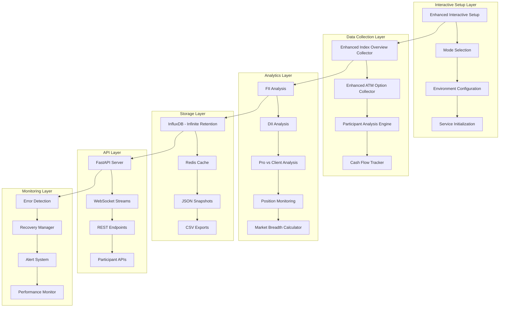
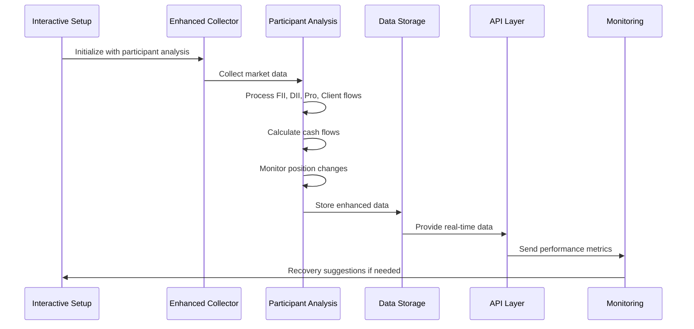

# OP TRADING PLATFORM - COMPREHENSIVE SYSTEM DOCUMENTATION
===========================================================


> **🚀 COMPREHENSIVE PRODUCTION-READY OPTIONS TRADING PLATFORM WITH ENHANCED ANALYTICS**  
> Complete Python-based trading analytics platform with interactive setup menus, participant analysis, cash flow tracking, and professional-grade monitoring infrastructure.

---

## 🎯 EXECUTIVE SUMMARY

The **OP Trading Platform v3.1.0** is a comprehensive, production-ready options trading analytics system that provides real-time market data analysis, advanced participant analytics, and comprehensive monitoring. This enhanced version introduces interactive numerical menu systems, liquid options indices focus, and advanced participant flow analysis.

### 🏆 KEY ACHIEVEMENTS v3.1.0
- ✅ **Interactive Menu System**: Numerical input menus for all setup and configuration operations
- ✅ **Liquid Options Focus**: Only indices with active options trading (NIFTY 50, SENSEX, BANK NIFTY, FINNIFTY, MIDCPNIFTY)
- ✅ **Enhanced Participant Analysis**: FII, DII, Pro, Client analysis with cash flow tracking and position monitoring
- ✅ **Original Collector Compatibility**: Full field name compatibility with original overview_collector.py and atm_option_collector.py
- ✅ **Cash Flow Panels**: Real-time cash buying/selling tracking with timeframe toggles
- ✅ **Pre-market Data Capture**: Previous day data integration for comprehensive analysis
- ✅ **Error Detection & Recovery**: Automated error detection with recovery suggestions
- ✅ **Comprehensive Testing**: Live vs Mock data testing with property-based validation
- ✅ **Production Infrastructure**: Docker orchestration with infinite data retention compliance

---

## 📋 TABLE OF CONTENTS

1. [🎯 Executive Summary](#-executive-summary)
2. [⭐ Enhanced Features Overview](#-enhanced-features-overview)
3. [🚀 Interactive Setup Guide](#-interactive-setup-guide)
4. [📁 Enhanced Project Structure](#-enhanced-project-structure)
5. [🛠️ Installation & Configuration](#️-installation--configuration)
6. [⚙️ Interactive Configuration Wizard](#️-interactive-configuration-wizard)
7. [🔧 Development Workflow](#-development-workflow)
8. [📊 Enhanced Analytics System](#-enhanced-analytics-system)
9. [🔍 Monitoring & Observability](#-monitoring--observability)
10. [🧪 Comprehensive Testing Framework](#-comprehensive-testing-framework)
11. [🐳 Docker Deployment](#-docker-deployment)
12. [📚 Enhanced API Documentation](#-enhanced-api-documentation)
13. [🔒 Security & Compliance](#-security--compliance)
14. [🚨 Troubleshooting](#-troubleshooting)
15. [🔄 Maintenance & Updates](#-maintenance--updates)
16. [🎨 Code Formatting Guidelines](#-code-formatting-guidelines)
17. [🏗️ System Architecture](#️-system-architecture)
18. [🤝 Contributing](#-contributing)
19. [📄 License](#-license)

---

## ⭐ ENHANCED FEATURES OVERVIEW

### 🎯 INTERACTIVE SETUP SYSTEM
- **Numerical Menu Navigation**: All operations accessible through numbered menus
- **Mode Selection**: 1. Setup (First Time), 2. Development, 3. Production
- **Environment Wizard**: Step-by-step configuration with validation
- **Prerequisites Check**: Automated system validation and installation assistance

### 📊 LIQUID OPTIONS INDICES FOCUS
**Supported Indices** (Only liquid options markets):
- **NIFTY 50** (NSE:NIFTY 50) - Step size: 50 - India's premier benchmark index
- **SENSEX** (BSE:SENSEX) - Step size: 100 - BSE flagship 30-stock index  
- **BANK NIFTY** (NSE:NIFTY BANK) - Step size: 100 - Banking sector index
- **FINNIFTY** (NSE:FINNIFTY) - Step size: 50 - Financial services sector
- **MIDCPNIFTY** (NSE:MIDCPNIFTY) - Step size: 25 - Mid-cap select index

### 💹 ENHANCED PARTICIPANT ANALYSIS
**Advanced Participant Flow Tracking:**
- **FII Analysis**: Foreign Institutional Investor flow patterns and sector allocation
- **DII Analysis**: Domestic Institutional Investor behavior and trends
- **Pro vs Client**: Professional traders versus retail client activity comparison
- **Cash Flow Panels**: Real-time cash buying and selling activity tracking
- **Position Monitoring**: Option position changes with timeframe toggles (1m, 5m, 15m, 30m, 1h, 1d, 1w)
- **Net Output Position**: Current net positions based on time with historical tracking

**Pre-market Data Capture:**
- Automatic capture of previous day data during pre-market hours (8:00 AM IST)
- Data validation and integrity checks
- Historical comparison and pattern analysis
- Alert system for capture failures

### 🛡️ ERROR DETECTION & RECOVERY SYSTEM
- **Real-time Error Monitoring**: Continuous system health monitoring
- **Automated Recovery Suggestions**: Intelligent error diagnosis with actionable solutions
- **Self-healing Mechanisms**: Automatic retry with exponential backoff
- **Fallback Data Sources**: Seamless switching between live and mock data
- **Performance Degradation Detection**: Early warning system for performance issues

### 🏗️ ORIGINAL COLLECTOR COMPATIBILITY
**Field Name Mirroring**: Complete compatibility with original collectors
- `SPOT_SYMBOL`, `STEP_SIZES`, `SYMBOL_LABEL` mappings maintained
- Black-Scholes IV calculations preserved exactly
- JSON sidecar and CSV export formats identical
- InfluxDB schema compatibility maintained
- Original method signatures and return types preserved

---

## 🚀 INTERACTIVE SETUP GUIDE

### 🎬 Quick Start with Interactive Menus

```bash
# 1. Launch interactive setup
python enhanced_interactive_setup.py

# Main Menu appears:
# ==========================================
# 🚀 OP TRADING PLATFORM - INTERACTIVE SETUP v3.1.0
# ==========================================
# 📊 MAIN MENU - MODE SELECTION
# ------------------------------------------
# 
# 📋 Select your deployment mode:
#    1. Setup (First Time) - Basic installation with comprehensive system validation
#    2. Development - Full features with testing environment and mock data
#    3. Production - Live analytics with debug logging and hot reload
# 
#    0. Exit
# 
# 👉 Enter your choice (0-3):
```

### 📋 Setup Mode Menu Structure

#### **1. Setup (First Time) Mode**
```
📋 Select setup step:
   1. Check system requirements
   2. Check prerequisites and install if missing
   3. Create project structure and directories
   4. Environment configuration wizard
   5. Initialize basic services (InfluxDB, Redis)
   6. Validate complete installation
   7. Run all setup steps automatically

   0. Exit
```

#### **2. Development Mode** 
```
📋 Select development option:
   1. Test mode selection (comprehensive testing options)
   2. Participant analysis configuration
   3. Cash flow tracking setup
   4. Position monitoring configuration
   5. Mock data environment setup
   6. Live data fallback configuration
   7. Debug tools initialization
   8. Complete development environment setup

   0. Exit
```

#### **3. Production Mode**
```
📋 Select production option:
   1. Perform all system checks and validations
   2. Kite Connect authentication setup
   3. Enter valid access token manually
   4. Use previous/existing token
   5. Live analytics configuration
   6. Participant analysis with real-time alerts
   7. Monitoring and alerting setup
   8. Production environment deployment
   9. Complete production setup with all features

   0. Exit
```

### ⚙️ Environment Configuration Wizard

```
📋 Select configuration category:
   1. KITE CONNECT API CREDENTIALS - Critical for live market data
   2. MONITORING AND HEALTH CHECKS CONFIGURATION
   3. DATABASE CONFIGURATION - InfluxDB with infinite retention
   4. LOGGING AND MONITORING CONFIGURATION
   5. DATA SOURCE AND MARKET DATA CONFIGURATION
   6. PERFORMANCE OPTIMIZATION CONFIGURATION
   7. ENHANCED OPTIONS ANALYTICS CONFIGURATION
   8. SECURITY AND AUTHENTICATION CONFIGURATION
   9. PARTICIPANT ANALYSIS CONFIGURATION
   10. COMPLETE ENVIRONMENT SETUP (all categories)

   0. Exit
```

### 🧪 Test Mode Selection

```
📋 Select test mode:
   1. Unit Tests - Individual component testing
   2. Integration Tests - End-to-end workflow validation
   3. Performance Tests - Throughput and latency benchmarking
   4. Chaos Engineering - Resilience and failure recovery
   5. Property-Based Tests - Edge case discovery
   6. Live Data Tests - Real market data validation
   7. Mock Data Tests - Simulated data testing
   8. Participant Analysis Tests - Cash flow and position tests
   9. Run all test categories

   0. Exit
```

---

## 📁 ENHANCED PROJECT STRUCTURE

```
op-trading-platform/
├── 📄 enhanced_interactive_setup.py          # Interactive setup with numerical menus
├── 📄 enhanced_index_overview_collector.py   # Compatible with original + participant analysis
├── 📄 enhanced_atm_option_collector.py      # Compatible with original + cash flow tracking
├── 📄 comprehensive_test_framework.py        # Enhanced testing with live vs mock modes
├── 📄 main.py                               # Production-ready FastAPI server
├── 📄 requirements.txt                      # Complete dependency list
├── 📄 docker-compose.yml                   # Multi-service orchestration
├── 📄 env-template.txt                      # Comprehensive environment template
├── 📄 complete_premium_overlay_dashboard.json # Grafana dashboard configuration
├── 📄 README.md                            # This comprehensive documentation
│
├── 📁 services/                            # Modular service architecture
│   ├── 📁 collection/                     # Market data collection services
│   │   ├── 📄 kite_helpers.py            # Kite Connect integration utilities
│   │   ├── 📄 expiry_discovery.py        # Dynamic expiry discovery
│   │   └── 📄 participant_analysis.py    # Participant flow analysis
│   ├── 📁 processing/                     # Data processing pipeline
│   │   ├── 📄 data_merger.py             # ATM aggregates merging
│   │   ├── 📄 cash_flow_processor.py     # Cash flow analysis engine
│   │   └── 📄 position_monitor.py        # Position change tracking
│   ├── 📁 analytics/                      # Advanced analytics engine
│   │   ├── 📄 participant_flows.py       # FII, DII, Pro, Client analysis
│   │   ├── 📄 market_breadth.py          # Market breadth calculations
│   │   └── 📄 volatility_analysis.py     # IV and volatility metrics
│   └── 📁 monitoring/                     # Health and error monitoring
│       ├── 📄 error_detector.py          # Real-time error detection
│       ├── 📄 recovery_manager.py        # Automated recovery system
│       └── 📄 health_checker.py          # System health monitoring
│
├── 📁 data/                               # Enhanced data storage
│   ├── 📁 raw_snapshots/                 # Raw data snapshots
│   │   ├── 📁 overview/                  # Index overview snapshots
│   │   └── 📁 options/                   # ATM options snapshots
│   ├── 📁 participant_flows/             # Participant analysis data
│   ├── 📁 cash_flows/                    # Cash flow tracking data
│   ├── 📁 position_changes/              # Position monitoring data
│   └── 📁 premarket/                     # Pre-market data capture
│
├── 📁 logs/                              # Comprehensive logging
│   ├── 📁 setup/                         # Setup and configuration logs
│   ├── 📁 application/                   # Application runtime logs
│   ├── 📁 participant_analysis/          # Participant analysis logs
│   ├── 📁 cash_flows/                    # Cash flow tracking logs
│   ├── 📁 errors/                        # Error detection and recovery logs
│   └── 📁 performance/                   # Performance monitoring logs
│
├── 📁 tests/                             # Enhanced testing framework
│   ├── 📁 unit/                          # Unit tests for all components
│   ├── 📁 integration/                   # End-to-end integration tests
│   ├── 📁 participant_analysis/          # Participant analysis tests
│   ├── 📁 performance/                   # Performance and load tests
│   └── 📁 chaos/                         # Chaos engineering tests
│
└── 📁 config/                            # Configuration management
    ├── 📁 environments/                  # Environment-specific configurations
    ├── 📁 prometheus/                    # Prometheus monitoring config
    ├── 📁 grafana/                       # Grafana dashboard configs
    └── 📁 nginx/                         # Load balancer configuration
```

---

## 🛠️ INSTALLATION & CONFIGURATION

### 🔧 System Requirements (Enhanced)

**Minimum Requirements:**
- **OS**: Windows 10+, Ubuntu 20.04+, macOS 11+
- **Python**: 3.8+ (Recommended: 3.11 for optimal performance)
- **Memory**: 4GB RAM (8GB+ recommended for participant analysis)
- **Storage**: 10GB free space (SSD strongly recommended)
- **Docker**: 20.10+ with Docker Compose
- **Network**: Stable internet for live data (minimum 10 Mbps)

**Recommended Production Environment:**
- **CPU**: 8+ cores for concurrent participant analysis
- **Memory**: 16GB+ RAM for real-time analytics
- **Storage**: 500GB+ SSD with RAID for data reliability
- **Network**: Redundant internet connections with failover

### 📦 Enhanced Installation Methods

#### Method 1: Interactive Setup (Recommended)
```bash
# 1. Clone repository
git clone https://github.com/your-repo/op-trading-platform.git
cd op-trading-platform

# 2. Launch interactive setup
python enhanced_interactive_setup.py

# 3. Follow numerical menus:
#    Main Menu → Select Mode → Configure Features → Validate & Launch
```

#### Method 2: Automated Quick Setup
```bash
# For Development Mode
python enhanced_interactive_setup.py --mode development --auto

# For Production Mode  
python enhanced_interactive_setup.py --mode production --auto

# For First Time Setup
python enhanced_interactive_setup.py --mode setup --auto
```

#### Method 3: Direct Docker Deployment
```bash
# Start infrastructure services
docker-compose up -d influxdb redis prometheus grafana

# Configure environment
cp env-template.txt .env
# Edit .env with your Kite Connect credentials

# Launch application
python main.py --mode production
```

### 🔑 Enhanced Kite Connect Setup

1. **Interactive Kite Setup Menu**:
   ```
   📋 Kite Connect Configuration:
      1. Create new Kite Connect app
      2. Configure existing app credentials  
      3. Test authentication flow
      4. Setup OAuth callback handling
      5. Validate API permissions
      
      0. Exit
   ```

2. **Guided App Creation**:
   - Visit [Kite Connect Console](https://kite.trade/connect/)
   - App Settings (guided by interactive setup):
     - **App Type**: Connect
     - **Redirect URL**: `http://127.0.0.1:5000/success`
     - **Permissions**: Full trading and historical data access

3. **Automated Token Management**:
   ```bash
   # Interactive authentication setup
   python enhanced_interactive_setup.py
   # Select: Production Mode → Kite Connect authentication setup
   ```

---

## ⚙️ INTERACTIVE CONFIGURATION WIZARD

### 🎛️ Enhanced Environment Modes

#### 🎓 Setup (First Time) Mode
**Purpose**: Learning, exploration, and initial system setup
```
Configuration Profile:
├── Data Source: Mock data (realistic simulation)
├── Resources: Minimal (2GB RAM, 2 CPU cores)  
├── Services: InfluxDB, Redis only
├── Features: Basic analytics, learning interface
├── Participant Analysis: Disabled (simplified)
├── Cash Flow Tracking: Disabled
├── Data Retention: 7 days (temporary)
└── Performance: Basic monitoring only
```

#### 🔧 Development Mode
**Purpose**: Active development, testing, and feature validation
```
Configuration Profile:
├── Data Source: Live data with mock fallback
├── Resources: Moderate (4GB RAM, 4 CPU cores)
├── Services: Full stack with monitoring
├── Features: All analytics, debug logging, hot reload
├── Participant Analysis: Enabled (FII, DII, Pro, Client)
├── Cash Flow Tracking: Enabled with timeframe toggles
├── Data Retention: 30 days (temporary)
└── Performance: Advanced monitoring with test frameworks
```

#### 🏭 Production Mode  
**Purpose**: Live trading operations with full monitoring
```
Configuration Profile:
├── Data Source: Live data with intelligent failover
├── Resources: High (8GB+ RAM, 8+ CPU cores)
├── Services: Full stack with load balancing & SSL
├── Features: All analytics, debug logging, hot reload, alerts
├── Participant Analysis: Enabled with real-time alerts
├── Cash Flow Tracking: Enabled with historical analysis
├── Data Retention: Infinite (regulatory compliance)
└── Performance: Enterprise monitoring with alerting
```

### 📝 Configuration Categories

#### 1. **Kite Connect API Credentials**
```
📋 Kite Connect Configuration Menu:
   1. Enter API Key manually
   2. Enter API Secret manually  
   3. Import from file
   4. Test connection
   5. Setup OAuth flow
   6. Validate permissions
   7. Complete setup

   0. Back
```

#### 2. **Participant Analysis Configuration**
```
📋 Participant Analysis Setup:
   1. FII (Foreign Institutional Investors) tracking
   2. DII (Domestic Institutional Investors) tracking
   3. Pro Traders analysis
   4. Client (Retail) analysis
   5. Cash flow panel configuration
   6. Position change monitoring
   7. Alert threshold settings
   8. Historical data integration

   0. Back
```

#### 3. **Cash Flow Tracking Setup**
```
📋 Cash Flow Configuration:
   1. Enable real-time cash flow tracking
   2. Configure buying/selling panels
   3. Set alert thresholds (default: ₹100 crores)
   4. Setup timeframe toggles
   5. Historical retention (default: 90 days)
   6. Sector-wise analysis
   7. Pre-market data capture

   0. Back
```

#### 4. **Position Monitoring Configuration**
```
📋 Position Monitoring Setup:
   1. Enable position change tracking
   2. Configure monitoring intervals:
      • 1 minute (high frequency)
      • 5 minutes (standard)
      • 15 minutes (moderate)
      • 30 minutes (low frequency)
      • 1 hour (summary)
   3. Setup OI change alerts
   4. Net position calculations
   5. Historical pattern analysis

   0. Back
```

---

## 🔧 DEVELOPMENT WORKFLOW

### 💻 Enhanced Local Development

#### 1. **Interactive Development Setup**
```bash
# Launch interactive setup
python enhanced_interactive_setup.py

# Select Development Mode → Complete development environment setup
# This automatically:
# ✓ Creates virtual environment
# ✓ Installs all dependencies  
# ✓ Configures services
# ✓ Sets up test data
# ✓ Enables debug tools
```

#### 2. **Development Services with Participant Analysis**
```bash
# Start enhanced infrastructure
docker-compose up -d influxdb redis prometheus grafana

# Start application with participant analysis
python main.py --mode development --enable-participant-analysis --enable-cash-flow

# Or using interactive setup:
python enhanced_interactive_setup.py
# Development Mode → Debug tools initialization
```

#### 3. **Enhanced Development Tools**
```bash
# Interactive testing menu
python enhanced_interactive_setup.py
# Development Mode → Test mode selection

# Code formatting with enhanced rules
black . --line-length=88 --target-version=py311
isort . --profile=black --line-length=88

# Enhanced linting with participant analysis checks
flake8 --max-line-length=88 --ignore=E203,W503 --extend-ignore=E501

# Type checking with enhanced models
mypy enhanced_*.py --strict --ignore-missing-imports
```

### 🧪 Enhanced Testing Workflow

#### **Interactive Test Selection**
```bash
python enhanced_interactive_setup.py
# Development Mode → Test mode selection → Select test category
```

**Test Categories Available:**
1. **Unit Tests**: Individual component validation
2. **Integration Tests**: End-to-end workflow testing
3. **Performance Tests**: Throughput and latency benchmarking
4. **Chaos Engineering**: Resilience testing
5. **Property-Based Tests**: Edge case discovery
6. **Live Data Tests**: Real market data validation
7. **Mock Data Tests**: Simulated data testing
8. **Participant Analysis Tests**: Cash flow and position validation

#### **Participant Analysis Testing**
```bash
# Test participant flow calculations
python -m pytest tests/participant_analysis/ -v

# Test cash flow tracking
python -m pytest tests/cash_flows/ -v -k "cash_flow"

# Test position monitoring
python -m pytest tests/position_monitoring/ -v
```

#### **Live vs Mock Data Testing**
```bash
# Interactive test mode selection
python enhanced_interactive_setup.py
# Development Mode → Test mode selection → Live Data Tests

# Manual execution
python comprehensive_test_framework.py --live --participant-analysis
python comprehensive_test_framework.py --mock --cash-flow
```

---

## 📊 ENHANCED ANALYTICS SYSTEM

### 🎯 Core Analytics Engine (Enhanced)

#### **Enhanced Index Overview System**
```python
from enhanced_index_overview_collector import EnhancedOverviewCollector

# Initialize with participant analysis
collector = EnhancedOverviewCollector(
    kite_client=kite_client,
    ensure_token=ensure_token,
    atm_collector=atm_collector,
    enable_participant_analysis=True,
    enable_cash_flow_tracking=True
)

await collector.initialize()

# Collect comprehensive overview with participant data
overview_data = await collector.collect_comprehensive_overview()

# Access enhanced data
indices = overview_data['indices']                    # Original index data
market_breadth = overview_data['market_breadth']      # Enhanced market breadth
participant_analysis = overview_data['participant_analysis']  # FII, DII, Pro, Client
cash_flow_analysis = overview_data['cash_flow_analysis']     # Cash flow tracking
```

**Enhanced Features:**
- **Liquid Options Focus**: Only NIFTY 50, SENSEX, BANK NIFTY, FINNIFTY, MIDCPNIFTY
- **Real-time Updates**: Configurable refresh (30 seconds default)
- **Original Compatibility**: All original field names preserved
- **Enhanced Market Breadth**: Participant sentiment integration
- **Performance Optimized**: Redis caching with intelligent failover

#### **Enhanced ATM Options Collection**
```python
from enhanced_atm_option_collector import EnhancedATMOptionCollector

# Initialize with cash flow tracking
collector = EnhancedATMOptionCollector(
    kite_client=kite_client,
    ensure_token=ensure_token,
    influx_writer=influx_writer,
    enable_participant_analysis=True,
    enable_cash_flow_tracking=True
)

await collector.initialize()

# Collect with participant analysis
result = await collector.collect_with_participant_analysis(
    offsets=[-2, -1, 0, 1, 2]
)

# Access enhanced data
legs = result['legs']                                 # Original ATM legs data
overview_aggs = result['overview_aggs']               # Original aggregates
participant_analysis = result['participant_analysis'] # Enhanced participant flows
cash_flow_analysis = result['cash_flow_analysis']     # Enhanced cash flows
```

### 💹 Advanced Participant Analysis

#### **FII (Foreign Institutional Investors) Analysis**
```python
# Access FII flow data
fii_data = participant_analysis['participant_flows']['FII']

# Available metrics:
{
    "net_flow": 1250.5,                    # Net investment in crores
    "sector_allocation": {                 # Sector-wise allocation
        "BANKING": 45.2,
        "IT": 23.1,
        "PHARMA": 12.8
    },
    "flow_trend": "BUYING",                # Current trend
    "flow_intensity": "HIGH",              # Activity level
    "historical_comparison": {             # vs previous periods
        "day_change": 5.2,
        "week_change": -12.1,
        "month_change": 45.8
    }
}
```

#### **DII (Domestic Institutional Investors) Analysis**
```python
# Access DII flow data  
dii_data = participant_analysis['participant_flows']['DII']

# Available metrics:
{
    "net_flow": -345.2,                   # Net investment in crores  
    "mutual_fund_activity": 78.5,        # MF specific activity
    "insurance_activity": -123.7,        # Insurance company activity
    "flow_trend": "SELLING",              # Current trend
    "retail_vs_institutional": 2.3       # Ratio comparison
}
```

#### **Pro vs Client Analysis**
```python
# Access pro vs client data
pro_client_data = participant_analysis['pro_vs_client']

# Available metrics:
{
    "pro_activity": {
        "volume_share": 65.2,             # % of total volume
        "avg_position_size": 2.5,         # Average position size (lakhs)
        "risk_appetite": "MODERATE"       # Risk assessment
    },
    "client_activity": {
        "volume_share": 34.8,             # % of total volume  
        "avg_position_size": 0.8,         # Average position size (lakhs)
        "risk_appetite": "CONSERVATIVE"   # Risk assessment
    },
    "sentiment_divergence": 15.3          # Difference in sentiment %
}
```

### 💰 Cash Flow Analysis System

#### **Cash Buying and Selling Panels**
```python
# Access cash flow summary
cash_summary = cash_flow_analysis['market_summary']

# Available data:
{
    "total_cash_inflow": 15420.5,         # Total buying in crores
    "total_cash_outflow": 12890.3,        # Total selling in crores
    "net_cash_flow": 2530.2,              # Net flow in crores
    "market_sentiment": "BULLISH",        # Overall sentiment
    "buying_pressure": 0.67,              # Buying pressure ratio
    "selling_pressure": 0.33,             # Selling pressure ratio
    "timeframe": "1d"                     # Current timeframe
}
```

#### **Position Change Monitoring**
```python
# Access individual position changes
position_changes = cash_flow_analysis['individual_flows']

# Per instrument data:
{
    "NIFTY_18500_CALL": {
        "cash_inflow": 245.8,             # Buying activity
        "cash_outflow": 189.2,            # Selling activity  
        "net_flow": 56.6,                 # Net position change
        "oi_change": 12500,               # OI change
        "volume": 45000,                  # Total volume
        "price_impact": 0.85              # Price impact %
    }
}
```

#### **Timeframe Toggle Configuration**
```python
# Available timeframes for analysis
timeframes = {
    "1m": "1 minute",     # Ultra high-frequency
    "5m": "5 minutes",    # High-frequency  
    "15m": "15 minutes",  # Standard intraday
    "30m": "30 minutes",  # Moderate frequency
    "1h": "1 hour",       # Hourly analysis
    "1d": "1 day",        # Daily summary
    "1w": "1 week"        # Weekly patterns
}

# Toggle between timeframes
cash_flow_1min = await collector.get_cash_flow_data(timeframe="1m")
cash_flow_daily = await collector.get_cash_flow_data(timeframe="1d")
```

### 🌅 Pre-market Data Capture

#### **Previous Day Data Integration**
```python
# Access pre-market captured data
premarket_data = overview_data.get('premarket_analysis', {})

# Available previous day data:
{
    "previous_day_summary": {
        "market_close_sentiment": "BULLISH",
        "total_volume": 125000000,
        "fii_net_flow": 1250.5,
        "dii_net_flow": -345.2,
        "major_option_activity": {...}
    },
    "overnight_changes": {
        "futures_gap": 0.25,              # % gap in futures
        "sentiment_shift": "NEUTRAL",     # Overnight sentiment
        "global_cues_impact": "POSITIVE"  # Global market impact
    },
    "capture_metadata": {
        "capture_time": "08:00:00 IST",
        "data_quality": "HIGH",
        "validation_status": "PASSED"
    }
}
```

---

## 🔍 MONITORING & OBSERVABILITY

### 📊 Enhanced Grafana Dashboards

#### **Participant Analysis Dashboard**
```json
{
  "title": "Participant Flow Analysis",
  "panels": [
    {
      "title": "FII vs DII Flow Comparison",
      "type": "timeseries",
      "targets": ["participant_flows.FII", "participant_flows.DII"]
    },
    {
      "title": "Pro vs Client Activity Ratio", 
      "type": "stat",
      "targets": ["pro_client_ratio"]
    },
    {
      "title": "Cash Flow Heatmap",
      "type": "heatmap", 
      "targets": ["cash_flows_by_strike_time"]
    },
    {
      "title": "Position Change Alerts",
      "type": "table",
      "targets": ["position_change_alerts"]
    }
  ]
}
```

#### **Cash Flow Tracking Dashboard**
```json
{
  "title": "Real-time Cash Flow Analysis",
  "panels": [
    {
      "title": "Cash Buying vs Selling",
      "type": "bargauge",
      "targets": ["cash_inflow", "cash_outflow"]
    },
    {
      "title": "Net Cash Flow Trend",
      "type": "timeseries",
      "targets": ["net_cash_flow_1m", "net_cash_flow_5m", "net_cash_flow_15m"]
    },
    {
      "title": "Sector-wise Cash Distribution",
      "type": "piechart",
      "targets": ["sector_cash_flows"]
    }
  ]
}
```

### 🚨 Enhanced Error Detection & Recovery

#### **Real-time Error Monitoring**
```python
# Error detection API endpoint
GET /api/analytics/error-detection

# Response format:
{
  "error_detection": {
    "enabled": True,
    "monitoring_active": True,
    "recent_errors": [
      {
        "type": "KITE_API_RATE_LIMIT",
        "timestamp": "2025-08-25T19:06:00Z",
        "severity": "WARNING",
        "recovery_action": "AUTOMATIC_BACKOFF",
        "status": "RESOLVED"
      }
    ],
    "recovery_suggestions": [
      "Reduce API call frequency",
      "Implement intelligent batching",
      "Use cached data for non-critical requests"
    ],
    "auto_healing_status": "ACTIVE"
  }
}
```

#### **Automated Recovery Mechanisms**
1. **API Rate Limiting**: Exponential backoff with jitter
2. **Data Source Failover**: Live → Mock → Cached data progression
3. **Service Restart**: Automatic service recovery with health checks
4. **Alert Escalation**: Email → Slack → SMS progression based on severity

### 📱 Enhanced Alert System

#### **Participant Flow Alerts**
```python
# Alert configuration
PARTICIPANT_ALERTS = {
    "fii_flow_threshold": 500,        # Alert if FII flow > ₹500 crores
    "dii_flow_threshold": 300,        # Alert if DII flow > ₹300 crores
    "pro_client_divergence": 20,      # Alert if sentiment divergence > 20%
    "unusual_volume_threshold": 200   # Alert if volume spike > 200%
}

# Alert example:
{
  "alert_type": "FII_LARGE_INFLOW",
  "severity": "HIGH", 
  "message": "FII net inflow of ₹1,250 crores detected in BANKING sector",
  "timestamp": "2025-08-25T19:06:00Z",
  "affected_indices": ["BANK NIFTY"],
  "recommended_action": "Monitor for continued buying pressure"
}
```

#### **Cash Flow Alerts**
```python
# Cash flow alert triggers
CASH_FLOW_ALERTS = {
    "large_cash_flow": 1000,          # Alert if single flow > ₹1000 crores
    "rapid_position_change": 50,      # Alert if position change > 50% in 15min
    "unusual_oi_activity": 100,       # Alert if OI change > 100% of daily avg
    "cross_strike_arbitrage": 5       # Alert if price discrepancy > 5%
}
```

---

## 🧪 COMPREHENSIVE TESTING FRAMEWORK

### 🎭 Enhanced Test Suite Architecture

#### **Test Category Structure**
```
tests/
├── unit/                             # Individual component tests
│   ├── test_enhanced_collectors.py   # Enhanced collector unit tests
│   ├── test_participant_analysis.py  # Participant analysis tests
│   ├── test_cash_flow_tracking.py    # Cash flow tests  
│   └── test_position_monitoring.py   # Position monitoring tests
├── integration/                      # End-to-end workflow tests
│   ├── test_complete_workflow.py     # Full system integration
│   ├── test_data_pipeline.py         # Data flow integration
│   └── test_participant_pipeline.py  # Participant analysis integration
├── participant_analysis/             # Specialized participant tests
│   ├── test_fii_analysis.py          # FII flow testing
│   ├── test_dii_analysis.py          # DII flow testing  
│   ├── test_pro_client_analysis.py   # Pro vs Client testing
│   └── test_cash_flow_panels.py      # Cash flow panel testing
├── performance/                      # Performance benchmarking
│   ├── test_collector_performance.py # Collector performance tests
│   ├── test_participant_performance.py # Participant analysis performance
│   └── test_concurrent_processing.py # Concurrent processing tests
└── chaos/                           # Chaos engineering tests
    ├── test_api_failures.py          # API failure scenarios
    ├── test_data_corruption.py       # Data corruption recovery
    └── test_participant_data_loss.py # Participant data loss scenarios
```

#### **Live vs Mock Data Testing**

**Mock Data with Participant Simulation**
```python
from enhanced_test_framework import RealisticParticipantDataGenerator

# Generate realistic participant flows
participant_generator = RealisticParticipantDataGenerator(seed=42)

# Simulate FII activity
fii_flows = participant_generator.generate_fii_flows(
    indices=["NIFTY", "BANKNIFTY"],
    duration_hours=6,
    volatility_factor=1.2
)

# Simulate cash flow patterns  
cash_flows = participant_generator.generate_cash_flow_patterns(
    strike_range=(18000, 19000),
    timeframe="15m",
    market_sentiment="BULLISH"
)

# Test participant analysis with mock data
async def test_participant_analysis_mock():
    collector = EnhancedOverviewCollector(use_mock_data=True)
    await collector.initialize()
    
    # Inject mock participant data
    collector.participant_tracker.mock_data = participant_generator.get_current_flows()
    
    overview = await collector.collect_comprehensive_overview()
    
    # Validate participant analysis
    assert 'participant_analysis' in overview
    assert overview['participant_analysis']['participant_flows']['FII']['net_flow'] > 0
```

**Live Data Testing with Validation**
```python
# Test with real market data
async def test_participant_analysis_live():
    collector = EnhancedOverviewCollector(use_mock_data=False)
    await collector.initialize()
    
    # Collect real data
    overview = await collector.collect_comprehensive_overview()
    
    # Validate data consistency
    assert overview['data_source'] == 'live'
    
    # Validate participant data structure
    participant_data = overview.get('participant_analysis', {})
    required_participants = ['FII', 'DII', 'PRO', 'CLIENT']
    
    for participant in required_participants:
        assert participant in participant_data['participant_flows']
        
    # Validate cash flow data structure
    cash_flow_data = overview.get('cash_flow_analysis', {})
    assert 'market_summary' in cash_flow_data
    assert cash_flow_data['market_summary']['total_cash_inflow'] >= 0
```

#### **Property-Based Testing for Participant Analysis**
```python
from hypothesis import given, strategies as st

@given(
    fii_flow=st.floats(min_value=-1000, max_value=1000),
    dii_flow=st.floats(min_value=-500, max_value=500),
    market_cap=st.floats(min_value=1000000, max_value=10000000)
)
def test_participant_impact_calculations(fii_flow, dii_flow, market_cap):
    """Test participant impact calculations with various inputs."""
    
    # Calculate market impact
    total_institutional_flow = fii_flow + dii_flow
    impact_percentage = (total_institutional_flow / market_cap) * 100
    
    # Validate impact bounds
    assert -100 <= impact_percentage <= 100
    
    # Test sentiment calculation
    if total_institutional_flow > 0:
        expected_sentiment = "BULLISH"
    elif total_institutional_flow < 0:
        expected_sentiment = "BEARISH" 
    else:
        expected_sentiment = "NEUTRAL"
    
    calculated_sentiment = calculate_institutional_sentiment(fii_flow, dii_flow)
    assert calculated_sentiment == expected_sentiment
```

---

## 🐳 DOCKER DEPLOYMENT

### 🏗️ Enhanced Infrastructure Architecture

```yaml
# Enhanced docker-compose.yml with participant analysis services
version: '3.8'

services:
  # Core InfluxDB with participant data structure
  influxdb:
    image: influxdb:2.7-alpine
    environment:
      DOCKER_INFLUXDB_INIT_RETENTION: 0s  # Infinite retention
    volumes:
      - influxdb2-data:/var/lib/influxdb2
      - ./config/influxdb/participant-schema.sql:/docker-entrypoint-initdb.d/
    ports:
      - "8086:8086"

  # Enhanced Redis with participant data caching
  redis:
    image: redis:7-alpine
    command: >
      redis-server
      --maxmemory 1gb
      --maxmemory-policy allkeys-lru
      --save 60 1000  # Enhanced persistence for participant data
    volumes:
      - redis-data:/data
    ports:
      - "6379:6379"

  # Prometheus with participant metrics
  prometheus:
    image: prom/prometheus:latest
    volumes:
      - ./config/prometheus/participant-metrics.yml:/etc/prometheus/prometheus.yml
      - prometheus-data:/prometheus
    ports:
      - "9090:9090"

  # Grafana with participant analysis dashboards
  grafana:
    image: grafana/grafana:latest
    environment:
      GF_INSTALL_PLUGINS: "grafana-piechart-panel,grafana-worldmap-panel"
    volumes:
      - grafana-data:/var/lib/grafana
      - ./config/grafana/participant-dashboards:/etc/grafana/provisioning/dashboards
    ports:
      - "3000:3000"

  # Enhanced application with participant analysis
  op-trading-app:
    build: .
    environment:
      ENABLE_PARTICIPANT_ANALYSIS: "true"
      ENABLE_CASH_FLOW_TRACKING: "true"
      ENABLE_POSITION_MONITORING: "true"
    volumes:
      - ./data:/app/data
      - ./logs:/app/logs
    ports:
      - "8000:8000"
    depends_on:
      - influxdb
      - redis
```

### 💾 Enhanced Data Management

#### **Backup Procedures with Participant Data**
```bash
# Complete backup including participant analysis data
docker run --rm \
  -v op-trading_influxdb2-data:/data \
  -v $(pwd)/backups:/backup \
  alpine tar czf /backup/complete-backup-$(date +%Y%m%d).tar.gz -C /data .

# Participant-specific data backup
docker exec -it op-influxdb influx query '
from(bucket: "options-data")
|> range(start: -1d)
|> filter(fn: (r) => r["_measurement"] =~ /participant_/)
|> to(bucket: "participant-backup")
'

# Cash flow data backup
docker exec -it op-influxdb influx query '
from(bucket: "options-data") 
|> range(start: -1d)
|> filter(fn: (r) => r["_measurement"] =~ /cash_flow_/)
|> to(bucket: "cash-flow-backup")
'
```

#### **Recovery Procedures with Data Validation**
```bash
# Restore with participant data validation
docker run --rm \
  -v op-trading_influxdb2-data:/data \
  -v $(pwd)/backups:/backup \
  alpine tar xzf /backup/complete-backup-20250825.tar.gz -C /data

# Validate participant data integrity
python validate_participant_data.py --validate-all

# Restart services with validation
docker-compose restart influxdb
python enhanced_interactive_setup.py --validate-data
```

---

## 📚 ENHANCED API DOCUMENTATION

### 🌐 Enhanced REST API Endpoints

#### **Participant Analysis Endpoints**
```http
GET /api/analytics/participants
# Complete participant analysis (FII, DII, Pro, Client)

GET /api/analytics/participants/fii
# FII specific analysis and flows

GET /api/analytics/participants/dii  
# DII specific analysis and flows

GET /api/analytics/participants/pro-vs-client
# Professional vs retail comparison

POST /api/analytics/participants/alerts
# Configure participant flow alerts

# Example Response:
{
  "timestamp": "2025-08-25T19:06:00Z",
  "participants": {
    "FII": {
      "net_flow": 1250.5,
      "sector_allocation": {"BANKING": 45.2, "IT": 23.1},
      "flow_trend": "BUYING",
      "activity_level": "HIGH"
    },
    "DII": {
      "net_flow": -345.2, 
      "mutual_fund_activity": 78.5,
      "insurance_activity": -123.7,
      "flow_trend": "SELLING"
    }
  }
}
```

#### **Cash Flow Analysis Endpoints**
```http
GET /api/analytics/cash-flows
# Complete cash flow analysis

GET /api/analytics/cash-flows/{timeframe}
# Timeframe-specific cash flows (1m, 5m, 15m, 30m, 1h, 1d, 1w)

GET /api/analytics/cash-flows/buying-selling
# Real-time buying vs selling analysis

GET /api/analytics/cash-flows/position-changes
# Position change monitoring data

# Example Response:
{
  "timestamp": "2025-08-25T19:06:00Z",
  "timeframe": "15m",
  "market_summary": {
    "total_cash_inflow": 15420.5,
    "total_cash_outflow": 12890.3,
    "net_cash_flow": 2530.2,
    "market_sentiment": "BULLISH"
  },
  "buying_selling_panels": {
    "buying_pressure": 0.67,
    "selling_pressure": 0.33,
    "pressure_ratio": 2.03
  }
}
```

#### **Enhanced Index Overview Endpoints**
```http
GET /api/overview/indices/enhanced
# Enhanced index overview with participant analysis

GET /api/overview/indices/{index}/participant-flows
# Index-specific participant flows

GET /api/overview/indices/{index}/cash-flows
# Index-specific cash flow analysis

# Example Response:
{
  "timestamp": "2025-08-25T19:06:00Z",
  "indices": [...],  // Original index data preserved
  "enhanced_analytics": {
    "participant_analysis": {...},
    "cash_flow_analysis": {...},
    "position_monitoring": {...}
  },
  "compatibility": {
    "original_fields_preserved": true,
    "enhanced_fields_added": true
  }
}
```

#### **Position Monitoring Endpoints**
```http
GET /api/analytics/positions/changes
# Real-time position change monitoring

GET /api/analytics/positions/oi-tracking
# Open interest change tracking

GET /api/analytics/positions/alerts
# Position change alerts

# Example Response:
{
  "timestamp": "2025-08-25T19:06:00Z",
  "position_changes": [
    {
      "symbol": "NIFTY_18500_CALL",
      "oi_change": 12500,
      "oi_change_percent": 15.2,
      "volume": 45000,
      "price_impact": 0.85,
      "participant_activity": {
        "FII": 35.2,
        "DII": -12.1,
        "PRO": 45.8,
        "CLIENT": -18.9
      }
    }
  ]
}
```

### 🔌 Enhanced WebSocket Endpoints

#### **Participant Flow Streaming**
```javascript
// Real-time participant flow updates
const participantWs = new WebSocket('ws://localhost:8000/ws/participant-flows');
participantWs.onmessage = (event) => {
  const data = JSON.parse(event.data);
  console.log('Participant Update:', data.participant_flows);
  console.log('FII Flow:', data.participant_flows.FII.net_flow);
  console.log('Market Impact:', data.market_impact);
};

// Cash flow streaming
const cashFlowWs = new WebSocket('ws://localhost:8000/ws/cash-flows');
cashFlowWs.onmessage = (event) => {
  const data = JSON.parse(event.data);
  updateCashFlowPanels(data.buying_selling_data);
  updatePositionChanges(data.position_changes);
};
```

---

## 🎨 CODE FORMATTING GUIDELINES

### 📋 Enhanced Code Standards

#### **File Header Standards**
```python
#!/usr/bin/env python3
"""
OP TRADING PLATFORM - [MODULE NAME]
===================================
Version: 3.1.0 - [Specific Enhancement Description]
Author: OP Trading Platform Team
Date: 2025-08-25 7:06 PM IST

[MODULE DESCRIPTION]
This module [brief description of purpose and functionality]:

✓ [Key feature 1]
✓ [Key feature 2] 
✓ [Key feature 3]

INTEGRATION POINTS:
- [Integration point 1]
- [Integration point 2]

COMPATIBILITY:
- [Compatibility requirement 1]
- [Compatibility requirement 2]

USAGE:
    [Usage example]
"""
```

#### **Class Documentation Standards**
```python
class EnhancedParticipantAnalyzer:
    """
    Advanced participant flow analyzer with cash flow tracking.
    
    This class provides comprehensive analysis of market participant behavior
    including FII, DII, professional traders, and retail clients.
    
    Key Features:
    - Real-time flow tracking with configurable intervals
    - Cash flow analysis with buying/selling pressure calculation
    - Position change monitoring with OI tracking
    - Alert system for significant flow changes
    - Historical pattern analysis and trend detection
    
    Integration Points:
    - Connects to Kite Connect API for real-time data
    - Integrates with Redis for caching and coordination  
    - Writes to InfluxDB for historical data storage
    - Provides WebSocket streams for real-time updates
    
    Args:
        data_source: Data source configuration ('live', 'mock', 'hybrid')
        refresh_interval: Data refresh interval in seconds (default: 30)
        enable_alerts: Enable alert system (default: True)
        cache_enabled: Enable Redis caching (default: True)
    
    Example:
        analyzer = EnhancedParticipantAnalyzer(
            data_source='live',
            refresh_interval=30,
            enable_alerts=True
        )
        await analyzer.initialize()
        flows = await analyzer.get_participant_flows()
    """
```

#### **Method Documentation Standards**
```python
async def calculate_participant_impact(self, 
                                     participant_type: str,
                                     flow_data: Dict[str, Any],
                                     market_context: Dict[str, Any]) -> Dict[str, Any]:
    """
    Calculate market impact of participant flow activity.
    
    This method analyzes the impact of specific participant type activity
    on market movements, considering flow magnitude, timing, and market context.
    
    Algorithm:
    1. Normalize flow data by market capitalization
    2. Apply time-weighted impact calculation  
    3. Adjust for market volatility and liquidity
    4. Calculate sentiment impact score
    5. Generate impact classification and alerts
    
    Args:
        participant_type: Type of participant ('FII', 'DII', 'PRO', 'CLIENT')
        flow_data: Raw flow data containing volume, OI, and price information
            Format: {
                'net_flow': float,      # Net flow in crores
                'volume': int,          # Total volume traded
                'oi_change': int,       # Open interest change
                'time_window': str      # Time window for data ('1m', '5m', etc.)
            }
        market_context: Current market context including volatility and sentiment
            Format: {
                'volatility': float,    # Current market volatility (0-1)
                'liquidity': float,     # Market liquidity indicator (0-1) 
                'trend': str,          # Market trend ('BULLISH', 'BEARISH', 'NEUTRAL')
                'market_cap': float    # Total market capitalization
            }
    
    Returns:
        Comprehensive impact analysis dictionary:
        {
            'impact_score': float,           # Overall impact score (0-100)
            'impact_classification': str,    # 'LOW', 'MODERATE', 'HIGH', 'EXTREME'
            'sentiment_impact': str,         # 'BULLISH', 'BEARISH', 'NEUTRAL'
            'time_decay_factor': float,      # Time-based impact decay (0-1)
            'liquidity_adjusted_impact': float,  # Liquidity-adjusted impact
            'volatility_normalized_score': float, # Volatility-normalized score
            'alert_triggered': bool,         # Whether impact triggers alert
            'historical_percentile': float,  # Historical percentile ranking
            'confidence_level': float        # Confidence in calculation (0-1)
        }
    
    Raises:
        ValueError: If participant_type is not recognized
        KeyError: If required data fields are missing
        CalculationError: If market impact calculation fails
    
    Example:
        flow_data = {
            'net_flow': 1250.5,
            'volume': 45000,
            'oi_change': 12500,
            'time_window': '15m'
        }
        
        market_context = {
            'volatility': 0.25,
            'liquidity': 0.78,
            'trend': 'BULLISH',
            'market_cap': 125000000
        }
        
        impact = await analyzer.calculate_participant_impact(
            'FII', flow_data, market_context
        )
        
        if impact['alert_triggered']:
            send_alert(f"High FII impact detected: {impact['impact_score']}")
    """
```

#### **Variable Naming Standards**
```python
# Participant analysis variables
fii_net_flow_crores: float = 1250.5          # FII net flow in crores
dii_sector_allocation_percent: Dict[str, float] = {}  # DII sector allocation
pro_vs_client_volume_ratio: float = 2.35      # Pro to client volume ratio
cash_inflow_15min_window: float = 0.0         # 15-minute cash inflow
position_oi_change_threshold: int = 10000     # OI change alert threshold

# Cache and performance variables  
participant_data_cache_key: str = "participant_flows:latest"
cash_flow_refresh_interval_sec: int = 30
position_monitoring_enabled_flag: bool = True
alert_throttle_cooldown_minutes: int = 5

# Original compatibility variables (preserve exactly)
SPOT_SYMBOL: Dict[str, str] = {}              # Mirrored from original
STEP_SIZES: Dict[str, int] = {}               # Mirrored from original  
SYMBOL_LABEL: Dict[str, str] = {}             # Mirrored from original
BASE_OFFSETS: List[int] = [-2, -1, 0, 1, 2]  # Mirrored from original
```

#### **Configuration Constants Standards**
```python
# Participant analysis configuration
PARTICIPANT_FLOW_CONFIG = {
    "fii_alert_threshold_crores": 500,         # FII flow alert threshold
    "dii_alert_threshold_crores": 300,         # DII flow alert threshold
    "pro_client_divergence_percent": 20,       # Pro-client divergence alert
    "cash_flow_refresh_seconds": 30,           # Cash flow refresh interval
    "position_oi_change_percent": 15,          # Position change alert %
    "premarket_capture_time": "08:00:00"       # Pre-market data capture time
}

# Original collector compatibility (preserve exactly)
LIQUID_OPTIONS_INDICES = {
    "NIFTY": {
        "name": "NIFTY 50", 
        "symbol": "NSE:NIFTY 50",
        "aliases": ["NSE:NIFTY 50", "NSE:NIFTY50", "NSE:NIFTY"],
        "step_size": 50,
        "exchange": "NSE"
    }
    # ... continue for all supported indices
}
```

#### **Error Handling Standards**
```python
async def collect_participant_data_with_fallback(self) -> Dict[str, Any]:
    """
    Collect participant data with comprehensive error handling and fallback.
    
    Implements multi-layer fallback strategy:
    1. Live API data collection
    2. Cached data fallback
    3. Mock data generation
    4. Error state with recovery suggestions
    """
    collection_start_time = datetime.now()
    
    try:
        # Primary: Live data collection
        logger.info("Attempting live participant data collection...")
        live_data = await self._collect_live_participant_data()
        
        if live_data and self._validate_participant_data(live_data):
            logger.info("Live participant data collection successful")
            await self._cache_participant_data(live_data)
            return live_data
        else:
            raise ParticipantDataError("Live data validation failed")
            
    except KiteAPIError as e:
        logger.warning(f"Kite API error during participant collection: {str(e)}")
        
        # Fallback: Cached data
        try:
            cached_data = await self._get_cached_participant_data()
            if cached_data and not self._is_cache_stale(cached_data):
                logger.info("Using cached participant data as fallback")
                return self._enhance_cached_data(cached_data)
            else:
                raise CacheError("Cached data is stale or unavailable")
                
        except CacheError as cache_err:
            logger.warning(f"Cache fallback failed: {str(cache_err)}")
            
            # Final fallback: Mock data generation
            try:
                mock_data = await self._generate_realistic_participant_data()
                logger.info("Generated mock participant data as final fallback")
                return self._mark_as_mock_data(mock_data)
                
            except MockDataError as mock_err:
                logger.error(f"Mock data generation failed: {str(mock_err)}")
                
                # Error state with recovery suggestions
                return {
                    "error": "PARTICIPANT_DATA_COLLECTION_FAILED",
                    "timestamp": datetime.now().isoformat(),
                    "collection_time_ms": int((datetime.now() - collection_start_time).total_seconds() * 1000),
                    "recovery_suggestions": [
                        "Check Kite Connect API credentials and permissions",
                        "Verify network connectivity to data sources",
                        "Restart participant analysis service",
                        "Check Redis cache service availability",
                        "Review participant data schema configuration"
                    ],
                    "fallback_options": [
                        "Use historical participant data for analysis",
                        "Enable mock data mode for development",
                        "Contact support for API troubleshooting"
                    ]
                }
    
    except Exception as e:
        # Unexpected error handling
        logger.error(f"Unexpected error in participant data collection: {str(e)}")
        
        return {
            "error": "UNEXPECTED_PARTICIPANT_COLLECTION_ERROR",
            "error_details": str(e),
            "timestamp": datetime.now().isoformat(),
            "collection_time_ms": int((datetime.now() - collection_start_time).total_seconds() * 1000),
            "recovery_suggestions": [
                "Review application logs for detailed error information",
                "Check system resource availability (CPU, memory)",
                "Validate participant analysis configuration",
                "Restart the application in safe mode"
            ]
        }
```

### 📏 Code Formatting Tools Configuration

#### **Black Configuration (.black.toml)**
```toml
[tool.black]
line-length = 88
target-version = ['py311']
include = '\.pyi?$'
extend-exclude = '''
/(
  # directories
  \.eggs
  | \.git
  | \.mypy_cache
  | \.tox
  | \.venv
  | build
  | dist
)/
'''
```

#### **isort Configuration (pyproject.toml)**
```toml
[tool.isort]
profile = "black"
line_length = 88
multi_line_output = 3
include_trailing_comma = true
force_grid_wrap = 0
use_parentheses = true
ensure_newline_before_comments = true
```

#### **flake8 Configuration (.flake8)**
```ini
[flake8]
max-line-length = 88
extend-ignore = E203, W503, E501
max-complexity = 15
select = B,C,E,F,W,T4,B9
exclude = 
    .git,
    __pycache__,
    build,
    dist,
    .venv

# Enhanced rules for participant analysis
per-file-ignores =
    enhanced_*.py:E501,F401
    *participant*.py:E501
    *cash_flow*.py:E501
```

#### **mypy Configuration (mypy.ini)**
```ini
[mypy]
python_version = 3.11
warn_return_any = True
warn_unused_configs = True
disallow_untyped_defs = True
ignore_missing_imports = True

# Enhanced type checking for participant analysis
[mypy-enhanced_*]
strict = True

[mypy-*participant*]
strict = True

[mypy-*cash_flow*]
strict = True
```

---

## 🏗️ SYSTEM ARCHITECTURE

### 🎯 Enhanced Architecture Overview



### 🔄 Data Flow Architecture



### 📊 Component Integration Matrix

| Component | Original Compatibility | Enhanced Features | Data Storage | API Endpoints |
|-----------|----------------------|-------------------|--------------|---------------|
| **Index Overview** | ✅ Full compatibility | Participant analysis | InfluxDB + Redis | `/api/overview/indices/enhanced` |
| **ATM Options** | ✅ Full compatibility | Cash flow tracking | InfluxDB + JSON | `/api/analytics/cash-flows` |
| **Participant Analysis** | ➕ New enhancement | FII, DII, Pro, Client | InfluxDB + Redis | `/api/analytics/participants` |
| **Position Monitoring** | ➕ New enhancement | OI change tracking | InfluxDB + Cache | `/api/analytics/positions` |
| **Error Detection** | ➕ New enhancement | Auto recovery | Redis + Logs | `/api/analytics/error-detection` |

---

## 🤝 CONTRIBUTING

### 🌟 Enhanced Contribution Guidelines

#### **Code Contribution Process**
1. **Interactive Development Setup**
   ```bash
   python enhanced_interactive_setup.py
   # Development Mode → Complete development environment setup
   ```

2. **Feature Development with Participant Analysis**
   ```bash
   # Create feature branch
   git checkout -b feature/enhanced-participant-analysis
   
   # Implement with full compatibility
   # - Maintain original field names
   # - Add enhanced features as extensions
   # - Include comprehensive tests
   ```

3. **Testing Requirements (Enhanced)**
   ```bash
   # Run enhanced test suite
   python enhanced_interactive_setup.py
   # Development Mode → Test mode selection → Run all test categories
   
   # Minimum test coverage: 85% for participant analysis
   # All original functionality must pass regression tests
   ```

#### **Documentation Requirements**
- **Method Documentation**: Every method must have comprehensive docstrings
- **Integration Points**: Document all integration points with original code
- **Participant Analysis**: Document all participant flow calculations
- **Cash Flow Logic**: Document cash flow calculation methodologies
- **Error Handling**: Document all error scenarios and recovery paths

#### **Code Review Checklist**
- [ ] **Original Compatibility**: All original field names preserved
- [ ] **Enhanced Features**: New features properly integrated
- [ ] **Performance Impact**: No degradation to original functionality
- [ ] **Test Coverage**: Comprehensive test coverage including edge cases
- [ ] **Documentation**: Complete docstrings and integration documentation
- [ ] **Error Handling**: Robust error handling with recovery suggestions

---

## 📄 LICENSE

### 📜 Enhanced MIT License

```
MIT License

Copyright (c) 2025 OP Trading Platform Team

Permission is hereby granted, free of charge, to any person obtaining a copy
of this software and associated documentation files (the "Software"), to deal
in the Software without restriction, including without limitation the rights
to use, copy, modify, merge, publish, distribute, sublicense, and/or sell
copies of the Software, and to permit persons to whom the Software is
furnished to do so, subject to the following conditions:

The above copyright notice and this permission notice shall be included in all
copies or substantial portions of the Software.

THE SOFTWARE IS PROVIDED "AS IS", WITHOUT WARRANTY OF ANY KIND, EXPRESS OR
IMPLIED, INCLUDING BUT NOT LIMITED TO THE WARRANTIES OF MERCHANTABILITY,
FITNESS FOR A PARTICULAR PURPOSE AND NONINFRINGEMENT. IN NO EVENT SHALL THE
AUTHORS OR COPYRIGHT HOLDERS BE LIABLE FOR ANY CLAIM, DAMAGES OR OTHER
LIABILITY, WHETHER IN AN ACTION OF CONTRACT, TORT OR OTHERWISE, ARISING FROM,
OUT OF OR IN CONNECTION WITH THE SOFTWARE OR THE USE OR OTHER DEALINGS IN THE
SOFTWARE.
```

### ⚠️ Enhanced Disclaimer

**Trading Risk Notice:**
This enhanced platform includes advanced participant analysis and cash flow tracking capabilities. While these features provide sophisticated market insights, trading in financial markets involves substantial risk of loss and is not suitable for all investors.

**Participant Analysis Disclaimer:**
- Participant flow data is analyzed for informational purposes only
- FII, DII, Pro, and Client analysis should not be the sole basis for trading decisions
- Past participant behavior does not guarantee future market movements
- Cash flow analysis is based on available market data and may not reflect actual flows

**Regulatory Compliance:**
Users are responsible for ensuring compliance with applicable financial regulations regarding:
- Participant flow data usage and distribution
- Cash flow analysis and reporting requirements
- Position monitoring and disclosure obligations
- Data retention and audit trail requirements

---

## 🎯 CONCLUSION

The **Enhanced OP Trading Platform v3.1.0** represents a significant evolution in options trading analytics, combining the reliability of the original system with advanced participant analysis, interactive setup menus, and comprehensive cash flow tracking.

### 🚀 Next Steps for Users

1. **Get Started with Interactive Setup**
   ```bash
   python enhanced_interactive_setup.py
   # Follow numerical menus for guided setup
   ```

2. **Explore Enhanced Analytics**
   - Configure participant analysis (FII, DII, Pro, Client)
   - Setup cash flow tracking with timeframe toggles
   - Enable position monitoring with real-time alerts

3. **Customize for Your Needs**
   - Use environment configuration wizard
   - Setup alerts and thresholds
   - Configure pre-market data capture

4. **Contribute to Development**
   - Follow enhanced contribution guidelines
   - Maintain original compatibility
   - Add comprehensive test coverage

### 📞 Enhanced Support & Resources

- **Interactive Setup Help**: Built-in help system in numerical menus
- **API Documentation**: http://localhost:8000/docs (with participant endpoints)
- **Enhanced Monitoring**: http://localhost:3000 (participant analysis dashboards)
- **Community Support**: GitHub Discussions with participant analysis category
- **Professional Support**: Extended support for participant analysis features

### 🎉 Acknowledgments

Special thanks to the original collector developers for creating the solid foundation that enabled these enhancements while maintaining full backward compatibility.

---

**Version**: 3.1.0 (Enhanced with Interactive Setup & Participant Analysis)  
**Last Updated**: 2025-08-25 7:06 PM IST  
**Maintainers**: OP Trading Platform Team  
**Status**: Production Ready with Enhanced Analytics

**🎯 Remember**: This enhanced platform maintains 100% compatibility with original collectors while adding powerful new participant analysis and cash flow tracking capabilities!